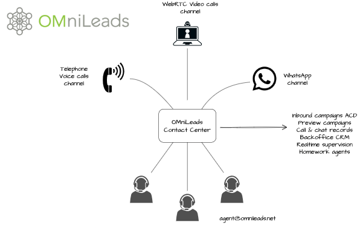

# 100% Open-Source Contact Center Software

## What is OMniLeads ?

OmniLeads (OML) is an innovative Open Source software solution leveraging WebRTC technology (WebRTC) to empower Contact Centers. Designed with versatility in mind, OML supports a wide range of communication channels including Voice, Video, and WhatsApp. This makes it an ideal choice for organizations looking to manage and deploy efficient, omni-channel customer service strategies.

As part of the roadmap of the develop we are planning to include SMS, Social Networks integration and Chat Campaigns from the web page, and many other features.

## Features

OML currently facilitates robust management and telephonic support using various campaign types:

* Inbound Campaigns: Efficiently manage incoming calls and route them to appropriate agents. ✅ 
* Preview Campaigns: Prepare agents with relevant information before they make a call. ✅ 
* Manual Outbound Campaigns: Provide tools for agents to manually reach out to customers with ease. ✅ 
* Web-Based Video Calls: Video call campaigns directly from web pages, enhancing the personal touch in customer interactions. ✅ 
* WhatsApp Integration: Expand your reach and accessibility with WhatsApp communication capabilities. ✅ 
* Multiple Text to Speech & Speech to text integractions from SaaS to opensource. ✅ 

Additionally, it includes the typical functionalities of contact center management:

* Agente & Supervisor console based on WebRTC. ✅ 
* Differents user profiles: administrator, supervisor admin, supervisor customer & agent. ✅ 
* Multiple campaigns: voice, video & WhatsApp management. ✅ 
* Answering machine detection. ✅ 
* Full Call & Chat registry. ✅ 
* Productivity reports. ✅ 
* Real time supervision. ✅ 
* Simple creation of Web forms. ✅ 
* CRM/ERP integration APIs. ✅ 
* Remotes Agents mode. ✅ 
* PBX integration. ✅ 

with Whatsapp (Beta):

* Have multiple users chating in same WhatsApp Number. ✅ 
* Connect to multiple WhatsApp accounts and receive all messages in one place. ✅ 
* Create and chat with new contacts without touching cellphone. ✅ 
* Send and receive message. ✅ 
* Send media (images/audio/documents). ✅ 
* Receive media (images/audio/video/documents). ✅ 

and video calls capabilities

* Manage video support campaigns. ✅ 
* Integrate video call capabilities into your website. ✅ 
* Share screen between agent and customer. ✅ 

## Run OMniLeads with docker-compose 🐳

To launch the application on your workstation (MAC, Linux, Windows) or generic linux host, ideal to obtain an instance of
the application practically without configuration.

[docker-compose](docker-compose/README.md)

## Run OMnileads with Ansible Multi Tenant automations 🏢 

To launch the application using Ansible on any modern Linux instance with [Podman](https://docs.podman.io/en/latest/) support.
Under this format, hundreds of instances of the application can be managed using Ansible.

[Ansible](ansible/README.md)

## Documentation 📚

OMniLeads documentation: https://docs.omnileads.net/

## Useful resources: 🎥  🎓 

* [Community Discord](https://discord.com/invite/CFZYxJtN)
* [Official training](https://www.omnileads.net/slides/entrenamiento-profesional-en-omnileads-1)
* [Youtube channel](https://www.youtube.com/@omnileadsoml7557)

## License 📃

GPLv3. Every source code file contains the license preamble and copyright details.

## Issues & Bugs reporting: 🐛 💡

For Issues & Bugs reporting: https://gitlab.com/omnileads/ominicontacto/issues

