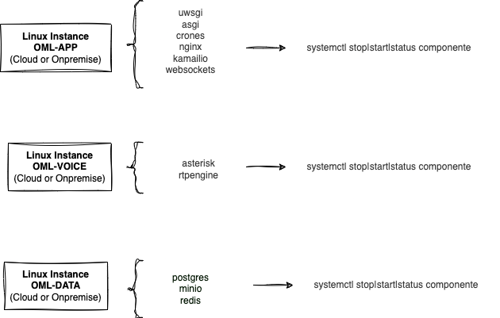

# Gestion de OMniLeads basada en Ansible

Esta forma de gestión abarca desde instalaciones de nuevas instancias, manejo de actualizaciones hasta la ejecución de procedimientos de backups & restore,
utilizando un único script y archivo de configuración.


## Indice

* [Bash, Ansible & System D](#bash-ansible-systemd)
* [Ansible + Inventory](#ansible-inventory)
* [Bash Script deploy.sh](#bash-script-deploy)
* [Deploy de nueva instancia LAN con Backing (Postgres y Object Storage) auto hosteado](#deploy-backing-self-hosted)
* [Deploy de nueva instancia con Backing (Postgres y Object Storage) como servicio Cloud](#deploy-backing-cloud-service)
* [Deploy de backup](#deploy-backup)
* [Deploy de actualizaciones](#deploy-upgrade)
* [Deploy de rollbacks](#deploy-rollbacks)

## Bash, Ansible & System D 📋 

La gestión se realiza desde la estación de trabajo del sysadmin a parir de dos archivos; deploy.sh e inventory.yml.
El primero es a quien se invoca para disparar la acción en concreto (deploy, upgrade, backup, etc.), el segundo
sirve para ajustar parámetros de configuración a ser implementados sobre la instancia a aplicar el despliegue.

Cada instancia de OMniLeads se materializa a partir de como minimo dos instancias de Linux (aplicacion y voz). Es decir que vamos a contar con un Linux host dedicado a ejecutar los contenedores "de aplicacion" mientras que en el segundo se ejecutan
los contenedores "de procesamiento de voz".



Luego una vez desplegada la aplicación en las instancias (app & voice), la gestión de componentes sera a través de systemd.

```
systemd start component
systemd restart component
systemd stop component
```

Esto aplica para los componentes desplegados sobre la instancia app (nginx, websockets, django, kamailio, postgresql, redis y minio)
así como también sobre la instancia voice (asterisk y rtpengine).


## Ansible + Inventory 🔧 

El archivo de inventario es la fuente de configuración de la instancia sobre la cual se va a trabajar.
Allí se ajustan parámetros como las versiones de las imágenes de cada componente o cuestiones de configuración
de base de datos (usuarios, passwords, etc.)

Respecto a este archivo, vamos a repasar los parámetros principales, es decir los que si o si debo
ajustar para lograr una instalación exitosa.

```
all:
  hosts:
    omnileads-voice:
      ansible_host: 190.19.111.23
      omni_ip_lan: 10.10.10.3
      application_host: 10.10.10.4
    omnileads-app:
      ansible_host: 190.19.111.22
      omni_ip_lan: 10.10.10.4
      voice_host: 10.10.10.3
```

omnileads-voice refiere a la instancia sobre la cual se van a desplegar los componentes asterisk y rtpengine, se debera especificar
 la direccion utilizada para que ansible se conecte y ejecute las tareas (ansible_host), luego la direccion de red local y
 finalmente la direccion del servidor de aplicacion sobre el cual se va a desplegar los componentes
 (nginx, websockets, django, kamailio, postgresql, redis y minio).


Respecto a las variables de deploy, por un lado tenemos variables exclusivas para la instancia de aplicacion, las mismas se encuentran
dentro del tab omnileads-app, como por ejemplo:

```
omnileads-app:
  ansible_host: 234.234.234.234
  omni_ip_lan: 10.10.10.4
  voice_host: 10.10.10.3
  # ---  kamailio shm & pkg memory params
  shm_size: 64
  pkg_size: 8
  # --- is the time in seconds that will last the https session when inactivity
  SCA: 3600
  ...
  ...
  ...
  ...
```

mientras que ademas contamos con las variables de omnileads existentes dentro del tab "hosts" que son parametros
que heredan ambas instancias (omnileads-app y omnileads-voice).

```
vars:
  # -- version images to deploy
  django_version: latest
  websockets_version: latest
  nginx_version: latest
  kamailio_version: latest
  asterisk_version: latest
  rtpengine_version: latest
  # --- "cloud" instance (access through public IP)
  # --- or "lan" instance (access through private IP)
  infra_env: cloud # (values: cloud or lan)
  # --- ansible user & port connection
  ansible_ssh_port: 22
  ansible_user: root
  ....
  ....
  ....
  ....
```


## Bash Script deploy.sh 📄 

Este script recibe parámetros que comandan la acción a efectuar, esta acción tiene que ver con invocar a la Playbook
matrix.yml quien a partir del archivo de inventario previamente editado terminara desplegando la acción en concreto sobre las instancias app y voice.

```
./deploy.sh --help

```

A la hora de una instalación o actualización se deben enviar dos parámetros:

* --action=
* --component=

```
./deploy.sh --action=install --component=all

```

Si quisiéramos enfocarnos en algún componente en particular, por ejemplo:

```
./deploy.sh --action=install --component=asterisk

```

## Deploy de nueva instancia LAN con Backing (Postgres y Object Storage) auto hosteado 🚀 

Se debe disponer de dos instancias Linux (Debian 11 o Rocky 8) con salida a internet y su clave publica (ssh) disponible, ya que
Ansible necesita establecer una conexión SSH para desplegar las acciones.

Luego se debe trabajar en el archivo inventory.yml

Respecto a las direcciones y conexiones:

```
omnileads-voice:
  ansible_host: 10.10.10.3
  omni_ip_lan: 10.10.10.3
  application_host: 10.10.10.4
omnileads-app:
  ansible_host: 10.10.10.4
  omni_ip_lan: 10.10.10.4
  voice_host: 10.10.10.3
```

El parámetro infra_env deberá inicializarse como 'lan'.

```
infra_env: lan
```

Y finalmente se deben comentar los parámetros ```bucket_url``` y ```postgres_host```, para que así ambos (PostgreSQL y Object Storage MinIO) sean desplegados dentro de la instancia de aplicación.

El resto de los parámetros se pueden personalizar como sea deseado.

Finalmente se debe ejecutar el deploy.sh.

```
./deploy.sh --action=install --component=all
```

## Deploy de nueva instancia con Backing (Postgres y Object Storage) como servicio administrado del Cloud 🚀 

Se debe disponer de dos instancias Linux (Debian 11 o Rocky 8) con salida a internet y su clave publica (ssh) disponible, ya que
Ansible necesita establecer una conexión SSH para desplegar las acciones.

Ademas bajo este formato se asume que PostgreSQL y Object Storage DB van a ser proporcionados como servicios administrados por el proveedor cloud seleccionado.
Esto implica que esos dos componentes de OMniLeads, en lugar de ser desplegados por nuestro Ansible, solamente debemos informar en el archivo
de inventory sus datos de conexión.

De esta manera OMniLeads va a almacenar los datos relacionales (SQL) y las grabaciones & backups sobre (Object Storage) del cloud, obviando
la instalación de ambos componentes dentro de la instancia Linux donde corre OMniLeads.

Vamos a plantear un inventory de referencia, en donde se supone que el cloud provider nos brinda los datos de conexión a Postgres.
En el parametro *postgres_host* se debe asignar el string de conexión correspondiente.
Luego simplemente se trata de ajustar los otros parámetros de conexión, de acuerdo a si vamos a necesitar establecer una conexión SSL, poner el *postgres_ssl: true*.
Si el servicio de PostgreSQL implica un cluster con mas de un nodo, entonces se puede activar mediante *postgres_ha: true*  y *postgres_ro_host: X.X.X.X*
para indicar que las queries se impacten sobre el nodo de replica del cluster.

Con respecto a Object Storage, se debe proporcionar el URL en *bucket_url*.
También los parámetros de autenticación deberán ser proporcionados; *bucket_access_key* & *bucket_secret_key* así como también el *bucket_name*.
Respecto al bucket_region en caso de no necesitar especificar nada, se debe dejarlo con el valor actual.

Finalmente se lanza el deploy:

```
./deploy.sh --action=install --component=all
```

## Deploy de backup

El deploy de un backup implica a los archivos de configuración personalizados de asterisk /etc/asterisk/custom por un lado y la base de datos
por el otro, utilizando el bucket asociado a la instancia como bitácora de los backups.

Para lanzar un backup simplemente se debe invocar el script de deploy.sh:

```
./deploy.sh --action=backup
```

## Deploy de actualizaciones

Cada actualización es materializada a través de un "push" a "latest". Es decir la imagen "latest" de cada componente
va a contar con los últimos cambios. Junto a la publicación de "latest" se sube también una imagen idéntica con un tag
basado en los 8 primeros caracteres del hash del commit inherente al cambio publicado en el repositorio. Esto ultimo
nos permite volver sobre una version anterior en caso de ser necesario un procedimiento de rollback.

```
face6cfa	Image	an hour ago	3 days ago
latest	  Image	an hour ago	3 days ago
```

Para aplicar actualizaciones simplemente debemos indicar a nivel de inventory.yml si es que se desea desplegar
versiones especificas de los componentes, por el contrario se procede con un "pull" de "latest".

```
django_version: latest
websockets_version: latest
nginx_version: latest
kamailio_version: latest
asterisk_version: latest
rtpengine_version: latest
```

Luego se debe invocar al script de deploy.sh con el parámetro --upgrade.

```
./deploy.sh --action=upgrade
```

### Rollback

El uso de contenedores a la hora de ejecutar los componentes de OMniLeads nos permite fácilmente aplicar rollbacks hacia versiones
históricas congeladas y accesible a través del "tag".

```
django_version: latest
websockets_version: latest
nginx_version: latest
kamailio_version: latest
asterisk_version: ff63617b
rtpengine_version: face6cfa
```

Luego se debe invocar al script de deploy.sh con el parámetro --upgrade.

```
./deploy.sh --action=upgrade
```
