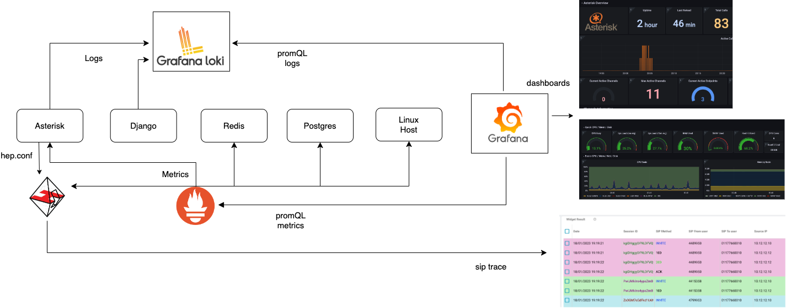
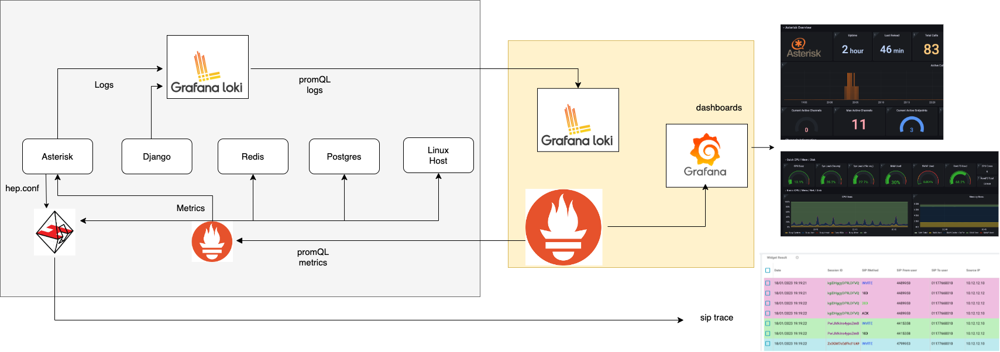

#### This project is part of OMniLeads


#### 100% Open-Source Contact Center Software
#### [Community Forum](https://forum.omnileads.net/)

---

# Ansible based OMniLeads management

In this repository you will find an alternative to implement OMniLeads tenant management from an on-premise
IT management perspective, but also super viable for working in cloud-computing environments.

The idea is to be able to manage several OMniLeads tenants from this ansible based management tool.

This option covers everything, from installing new instances, managing updates to executing backup & restore procedures,
all that using a single script and configuration file.


## Index

* [Bash, Ansible & System D](#bash-ansible-systemd)
* [Ansible + Inventory](#ansible-inventory)
* [Bash Script deploy.sh](#bash-script-deploy)
* [Subscriber tracking & TLS certs](#subscriber-traking)
* [Deploy de nueva instancia LAN con Backing (Postgres y Object Storage) auto hosteado](#onpremise-deploy)
* [Deploy de nueva instancia con Backing (Postgres y Object Storage) como servicio Cloud](#cloud-deploy)
* [TLS Certs provisioning](#tls-cert-provisioning)
* [Deploy a backup](#backups)
* [Deploy an upgrade](#upgrades)
* [Deploy a rollback](#rollback)
* [Observability](#observability)


## Bash, Ansible & System D 📋 <a name="bash-ansible-systemd"></a>

The management of multiple instances is done from the administrator's workstation. When preparing a new deployment
there are three fundamental files that are invoked in a chain, which help to understand how the management is planned
of the tenants, these are:

* **deploy.sh**: launch the root ansible playbook invoking the inventory file corresponding to the tenant that you want to manage.
* **inventory.yml**: configuration parameters of the OMniLeads instance to be deployed.
* **matrix.yml**: the ansible root playbook

Each instance of OMniLeads is generated on three Linux instances (application, voice, and observability).
In other words, we are going to have a Linux instance dedicated to executing the containers corresponding to the Application stack, on the second the containers of the voice processing stack are executed and on the third those of the observability stack.


Then, once OMnileads is deployed on the corresponding instances, each container on which a component works
can be managed as a systemd service.

```
systemd start component
systemd restart component
systemd stop component
```


## Ansible + Inventory 🔧 <a name="ansible-inventory"></a>

The inventory file is the configuration source of the instance on which you are going to work.
Parameters such as the component image version or configuration issues are adjusted there
database (users, passwords, etc.).

Regarding this file, we are going to review the main parameters, that is, those that do or should I
adjust for a successful installation.

We start with the data to provide about the three necessary linux instances, there we must
load the IP addresses corresponding to each linux instance so that Ansible can set the
connection, in addition to providing the LAN IP address of each instance.

So on the one hand we have the *ansible_host* parameter that implies the IP address over which
the SSH connection must be established by Ansible, while the *omni_ip_lan* parameter does
reference to a private address on which OMniLeads raises some services and uses
to communicate between the three instances. It may happen that both are worth the same (especially
in a deployment scenario over LAN or VPN)

```
all:
  hosts:
    omnileads-voice:
      omlvoice: true
      ansible_host: 190.10.19.200
      ansible_ssh_port: 22
      omni_ip_lan: 172.16.101.41
    omnileads-observability:
      omlobs: true
      ansible_host: 190.10.19.201
      ansible_ssh_port: 22
      omni_ip_lan: 172.16.101.43
    omnileads-app:
      omlapp: true
      ansible_host: 190.10.19.202
      ansible_ssh_port: 22
      omni_ip_lan: 172.16.101.42
```

Then we count the tenant variables to display, labeled/indented under *vars:*. Here we find
all the adjustable parameters when invoking a deploy on a group of instances. each one is
described by a *# --- comment* preceding it.

```
vars:
  # --- IP or hostname that each instance will invoke when locating the other
  voice_host: 172.16.101.41
  application_host: 172.16.101.42
  observability_host: 172.16.101.43
  # --- ansible user auth connection
  ansible_user: root
  # --- version of each image to deploy
  omnileads_version: latest
  websockets_version: latest
  nginx_version: latest
  kamailio_version: latest
  asterisk_version: latest
  rtpengine_version: latest
  # --- "cloud" instance (access through public IP)
  # --- or "lan" instance (access through private IP)
  # --- in order to set NAT or Publica ADDR for RTP voice packages
  infra_env: lan
  # --- If you have an DNS FQDN resolution, you must to uncomment and set this param
  # --- otherwise leave commented to work invoking through an IP address
  #fqdn: fidelio.sephir.tech

```

## Bash Script deploy.sh 📄 <a name="bash-script-deploy"></a>

This script receives parameters that command the action to be carried out, this action has to do with invoking the Playbook
matrix.yml who, from the previously edited inventory file, will end up deploying the specific action on the app and voice instances.

```
./deploy.sh --help

```

A la hora de una instalación o actualización se deben enviar dos parámetros:

* **--action=**
* **--tenant=**

```
./deploy.sh --action=install --tenant=tenant_name_folder

```

## Certs and inventory tenant folder :office: <a name="subscriber-traking"></a>

In order to manage multiple instances of OMniLeads from this deployment tool, you must create
a folder called **instances** at the root of this directory. The reserved name for this folder is
**instances** since said string is inside the .gitignore of the repository.

The idea is that the mentioned folder works as a separate GIT repository, thus providing the possibility
to maintain an integral backup in turn that the SRE or systems department is supported in the use of GIT.

```
git clone your_tenants_config_repo instances
```

Then, for each *instance* to be managed, a sub-folder must be created within instances.
For example:

```
instances/Subscriber_A
```

Once the tenant folder is generated, there you will need to place a copy of the *inventory.yml* file available
in the root of this repository, in order to customize and tack inside the private GIT repository.

```
cp inventory.yml instances/Subscriber_A
git add instances/Subscriber_A
git commit 'my new Subscriber A'
git push origin main
```

## Deploy a new LAN instance with Backend (Postgres and Object Storage) self-hosted 🚀 <a name="onpremise-deploy"></a>

You must have two Linux instances (Ubuntu 22.04, Debian 11, Rocky 8 or Alma Linux 8) with Internet access and **your public key (ssh) available**, since
ansible needs to establish an SSH connection through public key.

Then you should work on the inventory.yml file

Regarding addresses and connections:

```
omnileads-voice:
  ansible_host: 190.10.19.200
  ansible_ssh_port: 22
  omni_ip_lan: 10.10.10.3
omnileads-app:
  ansible_host: 190.10.19.100
  ansible_ssh_port: 22
  omni_ip_lan: 10.10.10.4
omnileads-observability:
  ansible_host: 190.10.19.300
  ansible_ssh_port: 22
  omni_ip_lan: 10.10.10.5
```

The infra_env parameter should be initialized as 'lan'.

```
infra_env: lan
```

And finally, the *bucket_url* and *postgres_host* parameters must be commented out, so that both (PostgreSQL and Object Storage MinIO) are deployed within the application instance.

The rest of the parameters can be customized as desired.

Finally, the deploy.sh should be executed.

```
./deploy.sh --action=install --tenant=tenant_name_folder
```

## Deploy a new instance with Backend (Postgres and Object Storage) as a managed Cloud service 🚀 <a name="cloud-deploy"></a>

You must have three Linux instances (Debian 11 or Rocky 8) with Internet access and **your public key (ssh) available**, since
Ansible needs to establish an SSH connection to deploy the actions.

Also under this format it is assumed that PostgreSQL and S3-compatible Object Storage are going to be provided as managed services by the selected cloud provider. This implies that these two OMniLeads components will not be deployed on the application instance as in the previous case.

We are going to propose a reference inventory, where the cloud provider is supposed to give us the connection data to Postgres.
The parameter *postgres_host* must be assigned the corresponding connection string.
Then it is simply a matter of adjusting the other connection parameters, according to whether we are going to need to establish an SSL connection, set the *postgres_ssl: true*.
If the PostgreSQL service involves a cluster with more than one node, then it can be activated by *postgres_ha: true* and *postgres_ro_host: X.X.X.X*
to indicate that the queries are impacted on the cluster replica node.

Regarding storage over Object Storage, the URL must be provided in *bucket_url*.
Also the authentication parameters must be provided; *bucket_access_key* & *bucket_secret_key* as well as the *bucket_name*.
Regarding the bucket_region, if you do not need to specify anything, you should leave it with the current value.

Finally the deploy is launched:

```
./deploy.sh --action=install --tenant=tenant_name_folder
```

## TLS/SSL certs provisioning :closed_lock_with_key: <a name="tls-cert-provisioning"></a>

From the inventory variable *certs* you can indicate what to do with the SSL certificates.
The possible options are:

* **selfsigned**: which will display the self-signed certificates (not recommended for production).
* **custom**: if the idea is to implement your own certificates. Then you must place them inside instances/tenant_name_folder/ with the names: *cert.pem* for and *key.pem*
* **certbot**: comign soon ...


## Post-installation steps :beer:

Once the URL is available with the App returning the login view, a command must be run
to whiten the admin password.

```
oml_manage.sh --reset_pass
```

From then on we can log in with the user *admin*, password *admin*.

It is also possible to generate a test environment by calling:

```
oml_manage.sh --init_env
```

Where some users, routes, trunks, forms, breaks, etc. are generated.

From then on we can log in with the agent type user *agent*, password *agent1**.


## Perform a Backup :floppy_disk: <a name="backups"></a>

Deploying a backup involves the asterisk custom configuration files /etc/asterisk/custom on the one hand and the database
on the other, using the bucket associated with the instance as a backup log.

To launch a backup, simply call the deploy.sh script:

```
./deploy.sh --action=backup --tenant=tenant_name_folder
```

## Upgrades :arrows_counterclockwise:  <a name="upgrades"></a>

The OMniLeads project builds images of all its components to be hosted in docker hub: https://hub.docker.com/repositories/omnileads.

We are going to differentiate the web application repository (https://hub.docker.com/repository/docker/omnileads/omlapp/general) whose
semantics implies the string RC (release candidates) or stable (able to deploy on production) string, before the dated version.

For example:

```
RC-230204.01
stable-230204.01
```

On the other hand, the rest of the components (asterisk, rtpengine, kamailio, nginx, websockets and postgres) are
named directly with the release date.

For example:

```
230204.01
```

Every time a new Release of the application becomes available as an image in the container registry, it will be impacted.
the **Releases-Notes.md** file available in the root of this repository, which exposes the mapping between the
versions of the images of each component for each release.

Therefore to apply updates we must first launch on this repository:

```
git pull origin main
```

Then indicate at the inventory.yml level within the corresponding tenant folder, the versions
desired.

```
omnileads_version: stable-230204.01
websockets_version: 230204.01
nginx_version: 230204.01
kamailio_version: 230204.01
asterisk_version: 230204.01
rtpengine_version: 230204.01
postgres_version: 230204.01
```

Then the deploy.sh script must be called with the --upgrade parameter.

```
./deploy.sh --action=upgrade --tenant=tenant_name_folder
```

## Rollback  :leftwards_arrow_with_hook: <a name="rollback"></a>

The use of containers when executing the OMniLeads components allows us to easily apply rollbacks towards versions
frozen history and accessible through the "tag".

```
omnileads_version: stable-190112.01
websockets_version: 190112.01
nginx_version: 190112.01
kamailio_version: 190112.01
asterisk_version: 190112.01
rtpengine_version: 190112.01
postgres_version: 190112.01
```

Then the deploy.sh script must be called with the --upgrade parameter.

```
./deploy.sh --action=upgrade --tenant=tenant_name_folder
```

## Observability :mag_right: <a name="observability"></a>

As it was well clarified, the OMniLeads deployment implies a Linux instance destined to officiate as a performance observer
of productive application. Therefore, on said instance, a stack is deployed based on:

* **Homer SIP Capture**: used to receive the SIP/RTP information sent to it by Asterisk (hep.conf). Homer stores this data and also provides a web interface to view real-time SIP traces.
* **Prometheus**: used to collect performance metrics from both the hosts (application / voice) and their components (asterisk, redis, postgres, etc.), also collects the metrics reported by SIP Homer Capture itself .

Finally, you will be able to have an instance of Grafana and invoke this Prometheus as a data-source and thus begin to deploy the dashboards.



It is also viable to use a Prometheus Central that collects metrics from each tenant (prometheus) and thus manage a more
redundant and robust in terms of storage backup.  




## License & Copyright

This project is released under the GNU Affero General Public License as published by the Free Software Foundation, either version 3 of the License, or (at your option) any later version.
