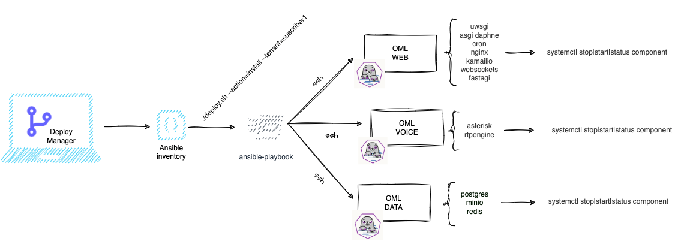
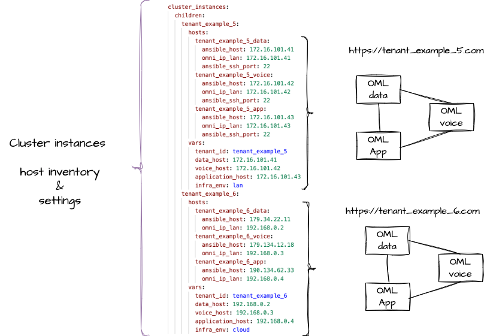

#### This project is part of OMniLeads


#### 100% Open-Source Contact Center Software
#### [Community Forum](https://forum.omnileads.net/)

---

# OMniLeads automation your subscribers deploys with Ansible

```
git clone https://gitlab.com/omnileads/omldeploytool.git
cd omldeploytool/ansible
```

In this section, we will find a tool manager for OMniLeads that will allow us to carry out deployments:

* new instances
* upgrades & rollbacks
* backup & restore

It is possible to manage hundreds of OMniLeads instances with Ansible inventories.


Then, for each running instance, a collection of components invoked as systemd services or docker-compose implement OMniLeads functionalities on the Linux instance (or set of instances).

Each OMniLeads instance involves the following collection of components that are run on a container. 
It is possible to group these containers on a single Linux instance or cluster them horizontally in a configuration.

>  Note: If working on a VPS with a public IP address, it is a mandatory requirement that it also has a network interface with the ability to associate a private IP address.


# Index

* [Bash + Ansible](#bash-ansible)
* [Ansible + Inventory](#ansible-inventory)
* [Bash Script deploy.sh](#bash-script-deploy)
* [Subscriber tracking & TLS certs](#subscriber-traking)
* [Deploy all in one (AIO) instance)](#aio-deploy)
* [Deploy Cluster all in three (AIT) instance)](#ait-deploy)
* [OMniLeads Podman containers](#podman)
* [Deploy with backend (Postgres y Object Storage) as cloud services](#cloud-deploy)
* [Deploy High Availability on-premise instance](#onpremise-deploy)
* [TLS Certs provisioning](#tls-cert-provisioning)
* [Security](#security)
* [Deploy an upgrade from CentOS7](#upgrade_from_centos7)
* [Deploy an upgrade](#upgrades)
* [Deploy a rollback](#rollback)
* [Deploy a backup](#backups)
* [Deploy a restore](#restore)
* [Observability](#observability)


# Bash + Ansible 📋 <a name="bash-ansible"></a>

An instance of OMniLeads is launched on a Linux server (using Systemd & Podman or docker-compose) by running a bash script (deploy.sh) along with its input parameters and a set of Ansible files (Playbooks + Templates) that are invoked by the script.

## Bash Script deploy.sh 📄 <a name="bash-script-deploy"></a>

This executable script triggers the deploy actions. It is responsible for receiving the action parameters to execute and the tenant on which to deploy the action.

The script searches for the inventory file of the tenant (or group of them) on which it needs to operate and then launches the root Ansible playbook (matrix.yml) through ansible-playbook with the corresponding tags to respond to the request made. 

```
./deploy.sh --help
```

To run an installation, upgrades, backup or restore deployment, two parameters must be called.

* **--action=**
* **--tenant=**

for example: 

```
./deploy.sh --action=install --tenant=tenants_folder_name
```

## Ansible 🔧 <a name="ansible-inventory"></a>

Ansible allows you to run a number of tasks on a set of hosts specified in your inventory file. Depending on the structure and variables of this file, OMniLeads instances based on docker or podman can be launched. 

This tool is capable of deploying OMniLeads in two layouts: 

* OML All in One with Podman & Systemd:


* OML  Cluster with Podman & Systemd:



The following is the generic version of inventory.yml file available in this repository.

In the first section of the file you can list the different hosts grouped by tenant and by type of deployment (All in one or Cluster).

AIO instances:


Cluster instances:



In the second section of the file you can parameterize the runtime variables. By default it affects ALL declared instances, unless the same variable is declared within the host or group specific variables section.

Finally, we have the section where the hosts should be grouped according arq. 
On one side we have the omnileads_aio family, here below you must list the AIO instances you want to deploy.
Then we have *omnileads_data*, *omnileads_voice*, *omnileads_app* where the instances that form clusters should be grouped. 


```
#############################################################################################################
# -- In this section the hosts are grouped based on the type of deployment (AIO, Cluster & Cluster HA).     #
#############################################################################################################

omnileads_aio:
  hosts:
    #tenant_example_1:
    #tenant_example_3:
    #tenant_example_4:
    #tenant_example_2:

omnileads_data:
  hosts:
    #tenant_example_5_data:
    #tenant_example_6_data:
    
omnileads_voice:
  hosts:
    #tenant_example_5_voice:
    #tenant_example_6_voice:

omnileads_app:
  hosts:
    #tenant_example_5_app:
    #tenant_example_6_app:
```

# Inventory file :office: <a name="subscriber-traking"></a>

In order to manage multiple instances (or group of them) from this deployment tool, you must create
a folder called **instances** at the root of this directory. The reserved name for this folder is
**instances** since said string is inside the .gitignore of the repository.

```
mkdir instances
```

Then, for each *instance* to be managed, a sub-folder must be created within instances.
For example:

```
mkdir instances/cloud_oml
mkdir instances/onpremise_oml
mkdir instances/company_A_omls
```

Once the tenant folder is generated, there you will need to place a copy of the *inventory.yml* file available
in the root of this repository, in order to customize and tack inside the private GIT repository.

```
cp inventory.yml instances/cloud_oml
cp inventory.yml instances/onpremise_oml
cp inventory.yml instances/company_A_omls
```

Then, once we have adjusted the inventory.yml file inside the tenant's folder, we can trigger its deployment.

```
./deploy.sh --action=install --tenant=cloud_oml
```

# TLS/SSL certs provisioning :closed_lock_with_key: <a name="tls-cert-provisioning"></a>

From the inventory variable *certs* you can indicate what to do with the SSL certificates.
The possible options are:

* **selfsigned**: which will display the self-signed certificates (not recommended for production).
* **custom**: if the idea is to implement your own certificates. Then you must place them inside instances/tenant_name_folder/ with the names: *cert.pem* for and *key.pem*

# Install on Linux instance 🚀 <a name="aio-deploy"></a>

You must have a generic Linux instance (Redhat or Debian based) with with internet access and your public SSH key available, as Ansible needs to establish an SSH connection using the public key.
The important thing is that the selected distribution has a version of Podman (3.0.0 or higher) available in its repositories. Something that we know Debian, Ubuntu, Rocky, or Alma Linux have.


Then you should work on the inventory.yml tenant file.

```
algarrobo:
  tenant_id: algarrobo
  ansible_host: 190.19.150.18
  omni_ip_lan: 172.16.101.44
  infra_env: lan
```

The ***infra_env*** variable can be initialized as "lan" or "cloud" (default), depending on whether the instance will be accessible via WAN access (IPADDR or FQDN) or via LAN access (IP or FQDN).

The *bucket_url* and *postgres_host* parameters must be commented out, so that both (PostgreSQL and Object Storage MinIO) are deployed within the AIO instance.

Then in the vars section, we have all the parameters that omnileads expects to work. These variables affect all the hosts that are going to be managed from this inventory.yml. 

Finally in the last section of the file, we must make sure that our tenant is listed in the omnileads_aio hosts group.

```
#############################################################################################################
# -- In this section the hosts are grouped based on the type of deployment (AIO, Cluster & Cluster HA).     #
#############################################################################################################

omnileads_aio:
  hosts:
    algarrobo:
    #tenant_example_3:
    #tenant_example_4:
    #tenant_example_2:

omnileads_data:
  hosts:
    #tenant_example_5_data:
    #tenant_example_6_data:
    
omnileads_voice:
  hosts:
    #tenant_example_5_voice:
    #tenant_example_6_voice:

omnileads_app:
  hosts:
    #tenant_example_5_app:
    #tenant_example_6_app:
```

Let's run the bash scrip:

```
./deploy.sh --action=install --tenant=tenant_name_folder
```

On OML App linux terminal, you must run reset_pass in order to perform a first login in the App.
Once the URL is available with the App returning the login view,  we can log in with the user *admin*, password *admin*.

```
oml_manage --reset_pass
```

# Install on three (Data, Voice & Web) cluster instances. 🚀 <a name="ait-deploy"></a>

You must have three Linux instances with Internet access and **your public key (ssh) available**, since
Ansible needs to establish an SSH connection to deploy the actions.


Then you should work on the inventory.yml tenant file.

```
# -----------------------------------------
# -----------------------------------------
cluster_instances:
  children:
    tenant_mr_x:
      hosts:
        tenant_mr_x_data:
          ansible_host: 172.16.101.41
          omni_ip_lan: 172.16.101.41
          ansible_ssh_port: 22
        tenant_mr_x_voice:
          ansible_host: 172.16.101.42
          omni_ip_lan: 172.16.101.42
          ansible_ssh_port: 22
        tenant_mr_x_app:
          ansible_host: 172.16.101.43
          omni_ip_lan: 172.16.101.43
          ansible_ssh_port: 22
      vars:
        tenant_id: tenant_mr_x
        data_host: 172.16.101.41
        voice_host: 172.16.101.42
        application_host: 172.16.101.43
        infra_env: lan
```
The parameter ansible_host refers to the IP or FQDN used to establish an SSH connection. The omni_ip_lan parameter refers to the private IP (LAN) that will be used when opening certain ports for components and when they connect with each other.

The infra_env variable can be initialized as "lan" or "cloud", depending on whether the OMniLeads instance will be accessible via WAN access (IPADDR or FQDN) or via LAN access (IP or FQDN).

The *bucket_url* and *postgres_host* parameters must be commented out, so that both (PostgreSQL and Object Storage MinIO) are deployed within the AIO instance.

The rest of the parameters can be customized as desired.

Finally in the last section of the file, we must make sure that our tenant is listed in the omnileads_aio hosts group.

```
omnileads_aio:
  hosts:
    #tenant_example_1:
    #tenant_example_2:
    #tenant_example_3:
    #tenant_example_4:

omnileads_data:
  hosts:
    tenant_mr_x_data:    
    
omnileads_voice:
  hosts:
    tenant_mr_x_voice:

omnileads_app:
  hosts:
    tenant_mr_x_5_app:

```

```
./deploy.sh --action=install --tenant=tenant_name_folder
```

On OML App linux terminal, you must run reset_pass in order to perform a first login in the App.
Once the URL is available with the App returning the login view,  we can log in with the user *admin*, password *admin*.

```
oml_manage --reset_pass
```

## Systemd & Podman 🔧 <a name="podman-systemd"></a>

Then, once OMnileads is deployed on the corresponding instance/s, each container on which a component works
can be managed as a systemd service.

```
systemctl start component
systemctl restart component
systemctl stop component
```

Behind every action triggered by the systemctl command, there is actually a Podman container that is launched, stopped, or restarted. This container is the result of the image invoked along with the environment variables.

For example, if we look at the systemd file of the Nginx component.

/etc/systemd/system/nginx.service looks like:

```
[Unit]
Description=Podman container-oml-nginx-server.service
Documentation=man:podman-generate-systemd(1)
Wants=network-online.target
After=network-online.target
RequiresMountsFor=%t/containers

[Service]
Environment=PODMAN_SYSTEMD_UNIT=%n
Restart=on-failure
TimeoutStopSec=70
ExecStartPre=/bin/rm -f %t/%n.ctr-id
ExecStart=/usr/bin/podman run \
  --cidfile=%t/%n.ctr-id \
  --cgroups=no-conmon \
  --sdnotify=conmon \
  --replace \
  --detach \
  --network=host \
  --env-file=/etc/default/nginx.env \
  --name=oml-nginx-server \
  --volume=/etc/omnileads/certs:/etc/omnileads/certs \
  --volume=django_static:/opt/omnileads/static \
  --volume=django_callrec_zip:/opt/omnileads/asterisk/var/spool/asterisk/monitor \
  --volume=nginx_logs:/var/log/nginx/ \
  --rm  \
  docker.io/omnileads/nginx:230215.01
ExecStop=/usr/bin/podman stop --ignore --cidfile=%t/%n.ctr-id
ExecStopPost=/usr/bin/podman rm -f --ignore --cidfile=%t/%n.ctr-id
Type=notify
NotifyAccess=all

[Install]
WantedBy=default.target
```

/etc/default/nginx.env looks like:

```
DJANGO_HOSTNAME=172.16.101.221
DAPHNE_HOSTNAME=172.16.101.221

KAMAILIO_HOSTNAME=localhost
WEBSOCKETS_HOSTNAME=172.16.101.221
ENV=prodenv

S3_ENDPOINT=http://172.16.101.221:9000
```

This is the standard for all components.

# Security 🛡️ <a name="security"></a>

OMniLeads is an application that combines Web (https), WebRTC (wss & sRTP) and VoIP (SIP & RTP) technologies. This implies a certain complexity and 
when deploying it in production under an Internet exposure scenario. 

On the Web side of the things the ideal is to implement a Reverse Proxy or Load Balancer ahead of OMnileads, i.e. exposed to the Internet (TCP 443) 
and that it forwards the requests to the Nginx of the OMniLeads stack. On the VoIP side, when connecting to the PSTN via VoIP it is ideal to 
operate behind an SBC (Session Border Controller) exposed to the Internet.

However, we can intelligently use the **Cloud Firewall** technology when operating over VPS exposed to the Internet.


Below are the Firewall rules to be applied on All In One instance:

* 443/tcp Nginx: This is where Web/WebRTC requests to Nginx are processed. Port 443 can be opened to the entire Internet.

* 40000/50000 UDP: WebRTC sRTP RTPengine: this port range can be opened to the entire Internet.

* 5060/UDP Asterisk: This is where SIP requests for incoming calls from the ITSP(s) are processed. This port must be opened by restricting by origin on the IP(s) of the PSTN SIP termination provider(s).

* 20000/30000 UDP VoIP RTP Asterisk: this port range can be opened to the entire Internet.

* 9090/tcp Prometheus metrics: This is where the connections coming from the monitoring center. This port can be opened by restricting by origin in the IP of the monitoring center.

# Upgrade from CentOS-7 OMniLeads instance :arrows_counterclockwise: <a name="upgrade_from_centos7"></a>


You must deploy the new OMniLeads instances making sure that the inventory.yml variables listed below should be the same as their 
counterparts in the CentOS 7 instance from which you want to migrate. below should be the same as their counterparts in the CentOS 7 instance from which you want to migrate.

* ami_user
* ami_password
* postgres_password
* postgres_database
* postgres_user
* dialer_user
* dialer_password

On the OMniLeads 1.X CentOS-7 instance run the following commands to generate a postgres backup on the one hand 
and then upload to the Bucket Object Storage of the new OMniLeads version the recordings, telephony audios, Asterisk customizations (if any) _custom.conf & _override.conf. 
(if any) Asterisk _custom.conf & _override_conf customizations and also the Postgres backup itself.

```
export NOMBRE_BACKUP=some_file_name
pg_dump -F c omnileads -f /tmp/pgsql-backup-$NOMBRE_BACKUP.sql --no-acl
export AWS_ACCESS_KEY_ID=$your_new_instance_bucket_key
export AWS_SECRET_ACCESS_KEY=$your_new_instance_bucket_secret_key
export S3_BUCKET_NAME=$your_new_instance_bucket_name
mkdir /opt/omnileads/asterisk/etc/asterisk/custom
cp /opt/omnileads/asterisk/etc/asterisk/*_custom* /opt/omnileads/asterisk/etc/asterisk/custom/
cp /opt/omnileads/asterisk/etc/asterisk/*_override* /opt/omnileads/asterisk/etc/asterisk/custom/
```

If you are going to use the object storage self-hosted by OMnileads in an AIO instance:
```
export S3_ENDPOINT=http://$OML_AIO_IP:9000 
```

If you are going to use the object storage self-hosted by OMnileads in an AIT cluster instance:
```
export S3_ENDPOINT=http://$OML_DATA_IP:9000 
```

If you are going to use an external object storage service:
```
export S3_ENDPOINT=https://$object_storage_url 
```

Finally, all backups are uploaded to the bucklet of the new OMniLeads instance:
```
aws --endpoint ${S3_ENDPOINT} s3 sync /opt/omnileads/media_root s3://${S3_BUCKET_NAME}/media_root
aws --endpoint ${S3_ENDPOINT} s3 sync /opt/omnileads/asterisk/var/spool/asterisk/monitor/ s3://${S3_BUCKET_NAME}
aws --endpoint ${S3_ENDPOINT} s3 cp /tmp/pgsql-backup-$NOMBRE_BACKUP.sql  s3://${S3_BUCKET_NAME}/backup/
aws --endpoint ${S3_ENDPOINT} s3 sync /opt/omnileads/asterisk/etc/asterisk/custom/ s3://${S3_BUCKET_NAME}/backup/asterisk/$NOMBRE_BACKUP/
```

Given that all the necessary components for restoring the service on the new infrastructure are available in the same Bucket,
you can proceed with deploying the restoration process.

At the end of the file there is the variable *restore_file_timestamp* which must contain the name used in the previous step to refer to the backups.
previous step to refer to the backups taken.

```
restore_file_timestamp: $NOMBRE_BACKUP
```

Execute the restore deploy on the tenant in question:

```
./deploy.sh --action=restore --tenant=$your_inventory_folder_name
```

# Perform a Backup :floppy_disk: <a name="backups"></a>


Deploying a backup involves the asterisk custom configuration files /etc/asterisk/custom on the one hand and the database
on the other, using the bucket associated with the instance as a backup log.

To launch a backup, simply call the deploy.sh script:

```
./deploy.sh --action=backup --tenant=tenant_name_folder
```

The backup is deposited in the bucket, being under the backup folder on one side a .sql file with the timestamp and on the other side another directory is generated with the timestamp date and there are the custom and override asterisk files.
another directory is generated with the timestamp date and there inside are the asterisk custom and override files.


# Upgrades :arrows_counterclockwise:  <a name="upgrades"></a>

The OMniLeads project builds images of all its components to be hosted in docker hub: https://hub.docker.com/repositories/omnileads.

We are going to differentiate the web application repository (https://hub.docker.com/repository/docker/omnileads/omlapp/general) whose
semantics implies the string RC (release candidates) or stable (able to deploy on production) string, before the dated version.

For example:

```
pre-release-1.27.0
1.27.0
```

On the other hand, the rest of the components (asterisk, rtpengine, kamailio, nginx, websockets and postgres) are
named directly with the release date.

For example:

```
230204.01
```

Every time a new Release of the application becomes available as an image in the container registry, it will be impacted.
the **Releases-Notes.md** file available in the root of this repository, which exposes the mapping between the
versions of the images of each component for each release.

Therefore to apply updates we must first launch on this repository:

```
git pull origin main
```

Then indicate at the inventory.yml level within the corresponding tenant folder, the versions
desired.

```
omnileads_version: 1.26.0
websockets_version: 230204.01
nginx_version: 230215.01
kamailio_version: 230204.01
asterisk_version: 230204.01
rtpengine_version: 230204.01
postgres_version: 230204.01
```

Then the deploy.sh script must be called with the --upgrade parameter.

```
./deploy.sh --action=upgrade --tenant=tenant_name_folder
```

# Rollback  :leftwards_arrow_with_hook: <a name="rollback"></a>


The use of containers when executing the OMniLeads components allows us to easily apply rollbacks towards versions
frozen history and accessible through the "tag".

```
omnileads_version: stable-190112.01
websockets_version: 190112.01
nginx_version: 190112.01
kamailio_version: 190112.01
asterisk_version: 190112.01
rtpengine_version: 190112.01
postgres_version: 190112.01
```

Then the deploy.sh script must be called with the --upgrade parameter.

```
./deploy.sh --action=upgrade --tenant=tenant_name_folder
```

# Restore :leftwards_arrow_with_hook: <a name="restore"></a>


You can proceed with a restore on a fresh installation as well as on a productive instance. 

Apply restore on the new instance: The two final parameters of the inventory.yml must be uncommented. On the one hand to indicate that the bucket does not have trusted certificates and the second one is to indicate the restore that we want to execute.
```
restore_file_timestamp: 1681215859 
```

Run restore deploy:

```
./deploy.sh --action=restore --tenant=digitalocean_deb
```

# Observability :mag_right: <a name="observability"></a>

Inside each subscriber linux instance the deployer put some containers in order to not only be able to 
to observe metrics at the operating system level but also to obtain specific metrics of components such as redis, postgres or asterisk, 
as well as to get the logs of the operating system and the also to get the logs of the operating system and the components and send them to the observability stack.

This allows us to propose a multi-instance observability center. On which it is possible to centralize the monitoring of OS and application metrics
of the OS and the application and its components, as well as centralizing log analysis.

This is possible thanks to the Prometheus approach together with its exporters for metrics monitoring on the one hand, and Loki and Promtail on the other. 
while Loki and Promtail implement the centralization of logs.

* **Loki**: used to storage file logs generated by OMniLeads components like django, nginx, kamailio, etc.
* **Promtail**: used to parse logs file on Linux VM nd send this to Loki DB.


Finally, you will be able to have an instance of Grafana and Prometheus that invoke this Prometheus deployed on tenat like data-source in order
to them build dashboards, on the other hand Grafana must to invoke the Loki deployed on tenant like data-source for logs analisys.


# License & Copyright

This project is released under the GNU Affero General Public License as published by the Free Software Foundation, either version 3 of the License, or (at your option) any later version.
