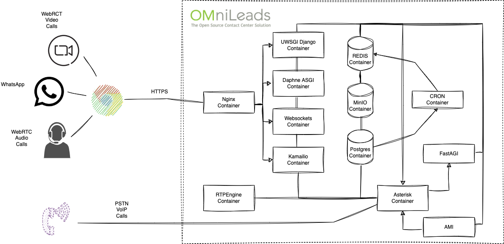
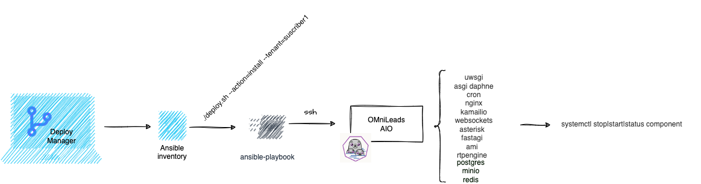
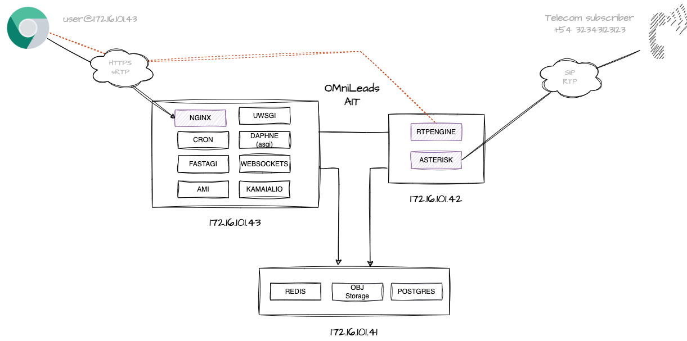
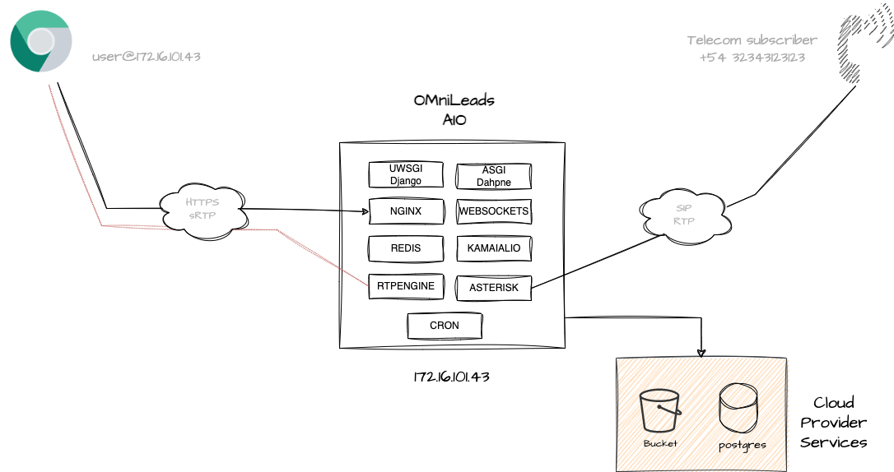
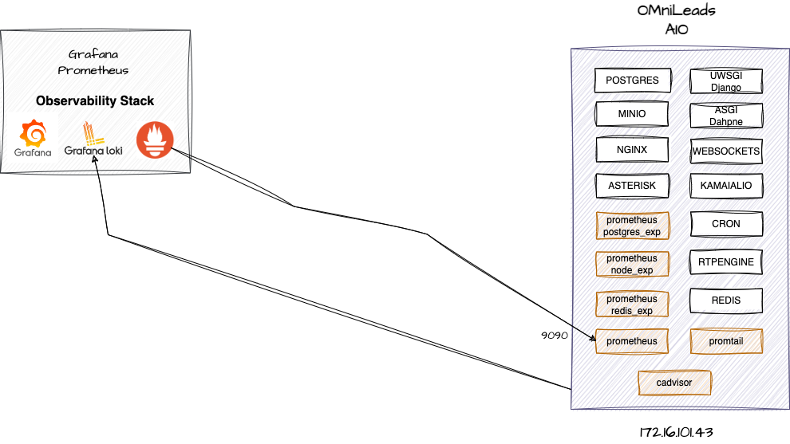

#### This project is part of OMniLeads


#### 100% Open-Source Contact Center Software
#### [Community Forum](https://forum.omnileads.net/)

---

# OMniLeads automation your subscribers deploys with Ansible

```
git clone https://gitlab.com/omnileads/omldeploytool.git
cd omldeploytool/ansible
```

In this section, we will find a tool manager for OMniLeads that will allow us to carry out deployments:

* new instances
* upgrades & rollbacks
* backup & restore

It is possible to manage hundreds of OMniLeads instances with Ansible inventories.


Then, for each running instance, a collection of components invoked as systemd services or docker-compose implement OMniLeads functionalities on the Linux instance (or set of instances).

Each OMniLeads instance involves the following collection of components that are run on a container. 
It is possible to group these containers on a single Linux instance or cluster them horizontally in a configuration.

>  Note: If working on a VPS with a public IP address, it is a mandatory requirement that it also has a network interface with the ability to associate a private IP address.



# Index

* [Bash + Ansible](#bash-ansible)
* [Ansible + Inventory](#ansible-inventory)
* [Bash Script deploy.sh](#bash-script-deploy)
* [OMniLeads Podman containers](#podman)
* [Subscriber tracking & TLS certs](#subscriber-traking)
* [Deploy all in one (AIO) instance)](#aio-deploy)
* [Deploy Cluster all in three (AIT) instance)](#ait-deploy)
* [Deploy with backend (Postgres y Object Storage) as cloud services](#cloud-deploy)
* [Deploy High Availability on-premise instance](#onpremise-deploy)
* [TLS Certs provisioning](#tls-cert-provisioning)
* [Deploy an upgrade from CentOS7](#upgrade_from_centos7)
* [Deploy an upgrade](#upgrades)
* [Deploy a rollback](#rollback)
* [Deploy a backup](#backups)
* [Deploy a restore](#restore)
* [Observability](#observability)


# Bash + Ansible 📋 <a name="bash-ansible"></a>

An instance of OMniLeads is launched on a Linux server (using Systemd & Podman or docker-compose) by running a bash script (deploy.sh) along with its input parameters and a set of Ansible files (Playbooks + Templates) that are invoked by the script.

## Bash Script deploy.sh 📄 <a name="bash-script-deploy"></a>

This executable script triggers the deploy actions. It is responsible for receiving the action parameters to execute and the tenant on which to deploy the action.

The script searches for the inventory file of the tenant on which it needs to operate and then launches the root Ansible playbook (matrix.yml) through ansible-playbook with the corresponding tags to respond to the request made. 

```
./deploy.sh --help
```

To run an installation, upgrades, backup or restore deployment, two parameters must be called.

* **--action=**
* **--tenant=**

for example: 

```
./deploy.sh --action=install --tenant=tenant_folder_name
```

## Ansible 🔧 <a name="ansible-inventory"></a>

Ansible is structured in an inventory file, a root playbook (matrix.yml), and a series of playbooks that implement base actions on the VM or group of VMs, as well as specific tasks that deploy each of the OMniLeads components.

The inventory file is where the type of OMniLeads to generate (all in one, all in three, or high availability) is stored, along with configuration parameters such as connection data for postgres, asterisk, redis, object storage, etc.

There are three types of inventory files for Ansible:

* **inventory_aio.yml**: It should be invoked when deploying OMniLeads all in one. That is, when deploying all App components on a single Linux instance with Systemd & Podman or docker-compose.




* **inventory_ait.yml**: It should be invoked when deploying OMniLeads all in three, that is, when deploying all App components on a cluster of three Linux instances (data, voice, & web).


* **inventory_ha.yml**: It should be invoked when deploying OMniLeads under an On-Premise High Availability scheme, based on two physical servers (hypervisors) with 8 VMs on which the components are distributed.


Each file is composed of a section where the hosts to operate on are declared along with their local variables. Depending on the format to be deployed (AIO, AIT or HA), it can be one or several hosts.
For example:

```
---
all:
  hosts:
    omnileads_aio:
      omlaio: true
      ansible_host: X.X.X.X
      omni_ip_lan: Z.Z.Z.Z
      ansible_ssh_port: 22
```

Then we count the tenant variables to display, labeled/indented under *vars:*. Here we find
all the adjustable parameters when invoking a deploy instance. each one is
described by a *# --- comment* preceding it.

```
vars:
    # --- ansible user auth connection
    ansible_user: root
    # --- Activate the OMniLeads Enterprise Edition - with "AAAA" licensed.
    # --- on the contrary you will deploy OMniLeads OSS Edition with GPLV3 licensed. 
    enterprise_edition: true
    # --- versions of each image to deploy
    # --- versions of each image to deploy
    omnileads_version: 1.26.0
    websockets_version: 230204.01
    nginx_version: 230215.01
    kamailio_version: 230204.01
    asterisk_version: 230204.01
    rtpengine_version: 230204.01
    postgres_version: 230204.01    
    # --- "cloud" instance (access through public IP)
    # --- or "lan" instance (access through private IP)
    # --- in order to set NAT or Publica ADDR for RTP voice packages
    infra_env: cloud
    # --- If you have an DNS FQDN resolution, you must to uncomment and set this param
    # --- otherwise leave commented to work invoking through an IP address
    #fqdn: fidelio.sephir.tech
```

## Systemd & Podman 🔧 <a name="ansible-inventory"></a>

Then, once OMnileads is deployed on the corresponding instance/s, each container on which a component works
can be managed as a systemd service.

```
systemd start component
systemd restart component
systemd stop component
```

Behind every action triggered by the systemctl command, there is actually a Podman container that is launched, stopped, or restarted. This container is the result of the image invoked along with the environment variables.

For example, if we look at the systemd file of the Nginx component.

/etc/systemd/system/nginx.service looks like:

```
[Unit]
Description=Podman container-oml-nginx-server.service
Documentation=man:podman-generate-systemd(1)
Wants=network-online.target
After=network-online.target
RequiresMountsFor=%t/containers

[Service]
Environment=PODMAN_SYSTEMD_UNIT=%n
Restart=on-failure
TimeoutStopSec=70
ExecStartPre=/bin/rm -f %t/%n.ctr-id
ExecStart=/usr/bin/podman run \
  --cidfile=%t/%n.ctr-id \
  --cgroups=no-conmon \
  --sdnotify=conmon \
  --replace \
  --detach \
  --network=host \
  --env-file=/etc/default/nginx.env \
  --name=oml-nginx-server \
  --volume=/etc/omnileads/certs:/etc/omnileads/certs \
  --volume=django_static:/opt/omnileads/static \
  --volume=django_callrec_zip:/opt/omnileads/asterisk/var/spool/asterisk/monitor \
  --volume=nginx_logs:/var/log/nginx/ \
  --rm  \
  docker.io/omnileads/nginx:230215.01
ExecStop=/usr/bin/podman stop --ignore --cidfile=%t/%n.ctr-id
ExecStopPost=/usr/bin/podman rm -f --ignore --cidfile=%t/%n.ctr-id
Type=notify
NotifyAccess=all

[Install]
WantedBy=default.target
```

/etc/default/nginx.env looks like:

```
DJANGO_HOSTNAME=172.16.101.221
DAPHNE_HOSTNAME=172.16.101.221

KAMAILIO_HOSTNAME=localhost
WEBSOCKETS_HOSTNAME=172.16.101.221
ENV=prodenv

S3_ENDPOINT=http://172.16.101.221:9000
```

This is the standard for all components.

# Inventory tenant folder :office: <a name="subscriber-traking"></a>

In order to manage multiple instances of OMniLeads from this deployment tool, you must create
a folder called **instances** at the root of this directory. The reserved name for this folder is
**instances** since said string is inside the .gitignore of the repository.

The idea is that the mentioned folder works as a separate GIT repository, thus providing the possibility
to maintain an integral backup in turn that the SRE or IT people is supported in the use of GIT.

```
cd omldeploytool/systemd
git clone your_tenants_config_repo instances
```

Then, for each *instance* to be managed, a sub-folder must be created within instances.
For example:

```
mkdir instances/Subscriber_A
```

Once the tenant folder is generated, there you will need to place a copy of the *inventory.yml* file available
in the root of this repository, in order to customize and tack inside the private GIT repository.

```
cp inventory_aio.yml instances/Subscriber_A/inventory.yml
git add instances/Subscriber_A
git commit 'my new Subscriber A'
git push origin main
```

Then, once we have adjusted the inventory.yml file inside the tenant's folder, we can trigger its deployment.

```
./deploy.sh --action=install --tenant=Subscriber_A
```

# TLS/SSL certs provisioning :closed_lock_with_key: <a name="tls-cert-provisioning"></a>

From the inventory variable *certs* you can indicate what to do with the SSL certificates.
The possible options are:

* **selfsigned**: which will display the self-signed certificates (not recommended for production).
* **custom**: if the idea is to implement your own certificates. Then you must place them inside instances/tenant_name_folder/ with the names: *cert.pem* for and *key.pem*

# Install on Linux instance 🚀 <a name="aio-deploy"></a>

You must have a generic Linux instance (Redhat or Debian based) with with internet access and your public SSH key available, as Ansible needs to establish an SSH connection using the public key.
The important thing is that the selected distribution has a version of Podman (3.0.0 or higher) available in its repositories. Something that we know Debian, Ubuntu, Rocky, or Alma Linux have.


You must to generate the tenant folder and put here an inventory.yml file, for example:

```
mkdir instances/my_subscriber_001
cp inventory_aio.yml instances/my_subscriber_001/inventory.yml
```

> Note: don't forget to generate the inventory.yml file from the appropriate template for the type of installation you want to deploy: _aio or _ait, or _ha.

Then you should work on the inventory.yml tenant file.

```
all:
  hosts:
    omnileads_aio:
      omldata: true
      ansible_host: 172.16.101.43 
      omni_ip_lan: 172.16.101.43
      ansible_ssh_port: 22      
  vars:
    # --- ansible user auth connection
    ansible_user: root
```

The parameter ansible_host refers to the IP or FQDN used to establish an SSH connection. The omni_ip_lan parameter refers to the private IP (LAN) that will be used when opening certain ports for components and when they connect with each other.

The ***infra_env*** variable can be initialized as "lan" or "cloud", depending on whether the instance will be accessible via WAN access (IPADDR or FQDN) or via LAN access (IP or FQDN).

Regarding the variable that is commented out by default, ***#fqdn:*** should be used (uncommented and initialized) as soon as the instance is accessed via a fqdn.

The rest of the variables are documented as comments within the file.


Let's run the bash scrip:

```
./deploy.sh --action=install --tenant=tenant_name_folder
```

On OML App linux terminal, you must run reset_pass in order to perform a first login in the App.
Once the URL is available with the App returning the login view,  we can log in with the user *admin*, password *admin*.

```
oml_manage --reset_pass
```

# Install on three (Data, Voice & Web) cluster instances. 🚀 <a name="ait-deploy"></a>

You must have three Linux instances (Debian 11, Ubuntu 22.04 or Rocky Linux 8) with Internet access and **your public key (ssh) available**, since
Ansible needs to establish an SSH connection to deploy the actions.



You must to generate the tenant folder and put here an inventory.yml file, for example:

```
mkdir instances/my_subscriber_002
cp inventory_ait.yml instances/my_subscriber_002/inventory.yml
```

> Note: don't forget to generate the inventory.yml file from the appropriate template for the type of installation you want to deploy: _aio or _ait, or _ha.

Then you should work on the inventory.yml tenant file.

```
all:
  hosts:
    omnileads_data:
      omldata: true
      ansible_host: 24.199.100.87
      omni_ip_lan: 10.10.10.2
      ansible_ssh_port: 22      
    omnileads_voice:
      omlvoice: true
      ansible_host: 144.126.221.171
      omni_ip_lan: 10.10.10.3
      ansible_ssh_port: 22      
    omnileads_app:
      omlapp: true
      ansible_host: 143.198.49.244
      omni_ip_lan: 10.10.10.4
      ansible_ssh_port: 22  
```

The parameter ansible_host refers to the IP or FQDN used to establish an SSH connection. The omni_ip_lan parameter refers to the private IP (LAN) that will be used when opening certain ports for components and when they connect with each other.

The infra_env variable can be initialized as "lan" or "cloud", depending on whether the OMniLeads instance will be accessible via WAN access (IPADDR or FQDN) or via LAN access (IP or FQDN).

Regarding the variable that is commented out by default, #fqdn should be used (uncommented and initialized) as soon as the instance is accessed via a hostname or FQDN.

And finally, the *bucket_url* and *postgres_host* parameters must be commented out, so that both (PostgreSQL and Object Storage MinIO) are deployed within the AIO instance.
The rest of the parameters can be customized as desired.
Finally, the deploy.sh should be executed.

```
./deploy.sh --action=install --tenant=tenant_name_folder
```

On OML App linux terminal, you must run reset_pass in order to perform a first login in the App.
Once the URL is available with the App returning the login view,  we can log in with the user *admin*, password *admin*.

```
oml_manage --reset_pass
```

# Deploy an OMniLeads AIO or AIT instance with Postgres DB and Bucket Object Storage as the cloud provider service. 🚀 <a name="onpremise-deploy"></a>

It is possible to deploy the application using external cloud services for both Postgres and Bucket. The majority of cloud infrastructure providers offer the possibility of requesting an instance with Postgres installed in addition to the Linux instances (VPS). Similarly, object storage can be requested as a service, generating a bucket for our deployment. This approach is very interesting because we consider the OMniLeads instance to be stateless, ephemeral, and fully viable within the perspective of immutable infrastructure.

So, You must have a Linux instance , as Ansible needs to establish an SSH connection using the public key. Additionally, you will need to have access to the object storage bucket and its access keys, as well as the connection details for the PostgreSQL database instances.



We are going to propose a reference inventory, where the cloud provider is supposed to give us the connection data to Postgres.
The parameter *postgres_host* must be assigned the corresponding connection string.
Then it is simply a matter of adjusting the other connection parameters, according to whether we are going to need to establish an SSL connection, set the *postgres_ssl: true*
If the PostgreSQL service involves a cluster with more than one node, then it can be activated by *postgres_ha: true* and *postgres_ro_host: X.X.X.X*
to indicate that the queries are impacted on the cluster replica node.

Regarding storage over Object Storage, the URL must be provided in *bucket_url*.
Also the authentication parameters must be provided; *bucket_access_key* & *bucket_secret_key* as well as the *bucket_name*.
Regarding the bucket_region, if you do not need to specify anything, you should leave it with the current value.

Some cloud providers custom parameters:

* Vultr example:

```
postgres_host: vultr-prod-04b0caa5-03fc-402d-95db-de5fb0bbeb1c-vultr-prod-a539.vultrdb.com
bucket_url: https://sjc1.vultrobjects.com

# --- PostgreSQL    
postgres_port: 16751
postgres_user: vultradmin
# --- *postgres* or *defaultdb* depend ...
postgres_maintenance_db: defaultdb
postgres_ssl: true
```

* Digital Ocean example:


```
postgres_host: private-oml-pgsql-do-user-6023066-0.b.db.ondigitalocean.com
bucket_url: https://sfo3.digitaloceanspaces.com

# --- PostgreSQL    
postgres_port: 25060
postgres_user: doadmin
# --- *postgres* or *defaultdb* depend ...
postgres_maintenance_db: defaultdb
postgres_ssl: true
```

Finally the deploy is launched:

```
./deploy.sh --action=install --tenant=tenant_name_folder
```

On OML App linux terminal, you must run reset_pass in order to perform a first login in the App.
Once the URL is available with the App returning the login view,  we can log in with the user *admin*, password *admin*.

```
oml_manage --reset_pass
```

# Deploy High Availability onpremise instance 🚀 <a name="cloud-deploy"></a>


We have an inventory file capable of materializing a high availability cluster on 2 Hypervisors (physical servers).  

The cluster essentially replicates all OMniLeads components in such a way that if one of the servers goes down, it can continue to operate by moving the services to the node that is still on.


The postgres, redis, asterisk, rtpengine, haproxy and CRON components are deployed in an Active-Passive scheme, i.e. there is one node that processes requests while the other remains in standby or Read Only state (in the case of Postgres, asterisk, rtpengine, haproxy and CRON). 
node that processes the requests while the other remains in standby or Read Only state (for Postgres).

In this deployment format, OMniLeads needs a load balancing stage to receive the Web requests.
and distribute them under some algorithm on the two instances (one VM on each hypervisor node) of the application that are executed.

On the side of the Web components (uwsgi, websockets, nginx, kamailio and daphne) they are arranged in an Active-Active format being 
Haproxy does the HTTP request balancing on both Active instances. 

There should be 8 virtual machines distributed under the following scheme:

* **Hypervisor A:** App + Redis Main, Postgres Main, Voice Backup
* **Hypervisor B:** App + Redis Backup, Postgres Backup, Voice Main


* Redis: Sentinel, who is the cluster manager, is used. He promotes on the basis of a logic the role of each Redis.
* Postgres: repmgr is used, which is the cluster director. Who promotes on a logical basis the role of each Postgres.
* Asterisk: Keepalived is used in order to supervise the active node and in case of a fall of the same one, to raise the Virtual IP (VIP) on the Failover node.
* HAProxy: Keepalived is used in order to monitor the active node and in case of node downtime, raise the Virtual IP (VIP) on the Failover node.
* Web Application: these nodes run as Active-Active, i.e. there are two instances of App running and attending requests based on the balancing that Haproxy carries out in a previous stage. 


>  Note: Access to an external Object Storage bucket is required. That is to say that the installation of OMniLeads
>in HA does not contemplate the deployment of MinIO Object Storage for now, so it is necessary to have the bucket and its access keys in order to continue with a high >availability deployment of the of the App in high availability, it is necessary to have the bucket and its access keys.


### Let's deploy !

You must to generate the tenant folder and put here an inventory.yml file, for example:

```
mkdir instances/my_subscriber_003
cp inventory_ha.yml instances/my_subscriber_003/inventory.yml
```
(don't forget to generate the inventory.yml file from the appropriate template for the type of installation you want to deploy: _aio or _ait, or _ha)

To deploy our cluster we must have 2 VMs with CentOS7 (for the Postgres cluster) on one side and 6 VMs with Debian11 (or ubuntu-22.04 or rocky linux 8) to build the App, Voice and Load balancer clusters. 

Let's assume the following distribution of components on the VMs and IP configuration:

```
VM data RW: 172.16.101.101 (Hypervisor A)
VM data RO: 172.16.101.102 (Hypervisor B)
VM voice main: 172.16.101.103 (Hypervisor B)
VM voice backup: 172.16.101.104 (Hypervisor A)
VM app+redis main: 172.16.101.105 (Hypervisor A)
VM app+redis backup: 172.16.101.106 (Hypervisor B)
VM haproxy main: 172.16.101.107 (Hypervisor B)
VM haproxy backup: 172.16.101.108 (Hypervisor A)

VIP postgres RW: 172.16.101.201
VIP postgres RO: 172.16.101.202
VIP voice_host: 172.16.101.203
VIP haproxy_host: 172.16.101.204
```

Then, as an example, we will continue with the IPs proposed at the time of creating the inventory file.

```
---
omnileads_data:
  hosts:
    sql_1:  
      ansible_host: 172.16.101.101      
      omni_ip_lan: 172.16.101.101
      ansible_ssh_port: 22
      ha_rol: main
    sql_2:  
      ansible_host: 172.16.101.102
      omni_ip_lan: 172.16.101.102
      ansible_ssh_port: 22  
      ha_rol: backup
  vars:
    postgres_host_ha: true
    ha_vip_nic: eth0
    netaddr: 172.16.101.0/16
    netprefix: 24
omnileads_voice:
  hosts:
    voice_1:  
      ansible_host: 172.16.101.103
      omni_ip_lan: 172.16.101.103
      ansible_ssh_port: 22
      ha_rol: main
    voice_2:
      ansible_host: 172.16.101.104
      omni_ip_lan: 172.16.101.104
      ansible_ssh_port: 22
      ha_rol: backup
  vars:
    omlvoice: true
    ha_vip_nic: ens18    
omnileads_haproxy:
  hosts:
    haproxy_1:
      ansible_host: 172.16.101.108
      omni_ip_lan: 172.16.101.108
      ansible_ssh_port: 22
      ha_rol: main
    haproxy_2:  
      ansible_host: 172.16.101.109
      omni_ip_lan: 172.16.101.109
      ansible_ssh_port: 22  
      ha_rol: backup
  vars:
    omlhaproxy: true
    ha_vip_nic: ens18
    app_port: 443
omnileads_app:
  hosts:
    app_1:  
      ansible_host: 172.16.101.105
      ansible_ssh_port: 22
      omni_ip_lan: 172.16.101.105
      ha_rol: main
    app_2:
      ansible_host: 172.16.101.106
      ansible_ssh_port: 22
      omni_ip_lan: 172.16.101.106
      ha_rol: backup
  vars:
    ha_vip_nic: ens18
    omlapp: true

all: 
  vars:
    # --- ansible user auth connection
    ansible_user: root

    # -- Cluster Redis IP (Haproxy VIP)
    redis_host: 172.16.101.204
    # --  Cluster redis Main node
    redis_ip_main: 172.16.101.104
    # --  Cluster postgres RW IP
    postgres_host: 172.16.101.201
    # --  Cluster postgres RO IP
    postgres_ro_host: 172.16.101.202
    # --  Cluster Voice (Asterisk + RTPengine) IP
    voice_host: 172.16.101.203
    # -- Cluster HTTP Web App (HAProxy VIP)
    application_host: 172.16.101.204
    # -- Cluster public NAT IP
    omni_ip_wan: 190.19.150.8

    kamailio_version: 230204.01
    asterisk_version: 230417.01
    rtpengine_version: 230204.01
    omnileads_version: 1.27.0
    websockets_version: 230204.01
    nginx_version: 230215.01
    postgres_version: 230204.01
    centos_postgresql_version: 11
    ...
    ...
    ...
    ...
```

> Note: Remember that all VMs must have the ssh key of our deployer: **ssh-copy-id root@....**.

Finallly:

```
./deploy.sh --action=install --tenant=tenant_name_folder
```

The layout of the components contemplates the execution of both the RW node of postgres and redis on the hypervisor A, 
while the active node of Asterisk and Haproxy on hypervisor B.


Therefore we have a failover if the Hypervisor-A crashes then the Postgres-RW and Redis-RW components fail over to Hypervisor-B.
on Hypervisor-B. While if Hypervisor-B goes down the Haproxy-active and Asterisk-active components execute a failover on Hypervisor-A. 
failover to Hypervisor-A.

On OML App linux terminal, you must run reset_pass in order to perform a first login in the App.
Once the URL is available with the App returning the login view,  we can log in with the user *admin*, password *admin*.

```
oml_manage --reset_pass
```


### **Recovery Postgres main node**

When a Failover from Postgres Main to Postgres Backup occurs, then the Backup node takes the floating IP of the cluster and remains as the only RW/RO node with its corresponding IPs. 
as the only RW/RO node with its corresponding IPs. 

To return Postgres to the initial state two actions must be carried out:

```
./deploy.sh --action=pgsql_node_recovery_main --tenant=tenant_name_folder
```

This command is in charge of rejoining the Postgres Main node to the cluster. But if we only execute this action then 
the Cluster will be inverted, i.e. Postgres B as main and Postgres A as backup.

### **Takeover Postgres main node**


This command implies that a Recovery has been previously executed as described in the previous step.

```
./deploy.sh --action=pgsql_node_takeover_main --tenant=tenant_name_folder
```

After the execution of the takeover we will have the cluster in the initial state, i.e. Postgres A as Main and Postgres B as backup.

### **Takeover Redis main node**


A last action to be taken has to do with the takeover of the Redis node, in such a way that we leave the Redis cluster in the initial state, i.e. Redis A as main and Redis B as backup, that is to say Redis A as main and Redis B as backup.

```
./deploy.sh --action=redis_node_takeover_main --tenant=tenant_name_folder
```

### **Recovery Postgres backup node**

When the VM hosting the Postgres Backup node shuts down, the Main node takes the floating RO IP of the cluster and remains as the only RW/RO node with its corresponding IPs. as the only RW/RO node with its corresponding IPs. To rejoin the backup node to the cluster and in this way recover the RO's VIP, it is necessary to run a
the RO VIP, a recovery deploy of the postgres backup node must be executed.

```
./deploy.sh --action=pgsql_node_recovery_backup --tenant=tenant_name_folder
```


# Post-installation steps :beer:

It is also possible to generate a test environment by calling:

```
oml_manage --init_env
```

Where some users, routes, trunks, forms, breaks, etc. are generated.

From then on we can log in with the agent type user *agent*, password *agent1**.

# Upgrade from CentOS-7 OMniLeads instance :arrows_counterclockwise: <a name="upgrade_from_centos7"></a>


You must deploy an "all in three" instance of OMniLeads making sure that the inventory.yml variables listed below should be the same as their 
counterparts in the CentOS 7 instance from which you want to migrate. below should be the same as their counterparts in the CentOS 7 instance from which you want to migrate.

* ami_user
* ami_password
* postgres_password
* postgres_database
* postgres_user
* dialer_user
* dialer_password

On the OMniLeads 1.2X CentOS-7 instance run the following commands to generate a postgres backup on the one hand 
and then upload to the Bucket Object Storage of the new OMniLeads version the recordings, telephony audios, Asterisk customizations (if any) _custom.conf & _override.conf. 
(if any) Asterisk _custom.conf & _override_conf customizations and also the Postgres backup itself.

```
export NOMBRE_BACKUP: algun_nombre
pg_dump omnileads > /tmp/pgsql-backup-$NOMBRE_BACKUP.sql
export AWS_ACCESS_KEY_ID=uLZTnLB0aURXI6NB
export AWS_SECRET_ACCESS_KEY=VSlMrqEWS7aWtgrn7G2zs949W6jdFleY
export S3_ENDPOINT=https://172.16.101.3:9000
export S3_BUCKET_NAME=tenant1 # nombre del bucket del inventory.yml env 2.0
aws --endpoint ${S3_ENDPOINT} --no-verify-ssl s3 sync /opt/omnileads/media_root s3://${S3_BUCKET_NAME}/media_root
aws --endpoint ${S3_ENDPOINT} --no-verify-ssl s3 sync /opt/omnileads/asterisk/var/spool/asterisk/monitor/ s3://${S3_BUCKET_NAME}
aws --endpoint ${S3_ENDPOINT} --no-verify-ssl s3 cp /tmp/pgsql-backup-$NOMBRE_BACKUP.sql  s3://${S3_BUCKET_NAME}/backup/
mkdir /opt/omnileads/asterisk/etc/asterisk/custom
cd /opt/omnileads/asterisk/etc/asterisk
cp *_custom* ./custom
cp *_override* ./custom
aws --endpoint ${S3_ENDPOINT} --no-verify-ssl s3 sync /etc/asterisk/custom/ s3://${S3_BUCKET_NAME}/backup/asterisk/$NOMBRE_BACKUP/
```

From the fact of having everything necessary to restore the service on the new infrastructure in the Bucket of the same one, 
you can proceed with the deploy of this restoration process. 

At the end of the file there is the variable *restore_file_timestamp* which must contain the name used in the previous step to refer to the backups.
previous step to refer to the backups taken.

```
restore_file_timestamp: NOMBRE_BACKUP
```

Execute the restore deploy on the tenant in question:

```
./deploy.sh --action=restore --tenant=tenant1
```

# Perform a Backup :floppy_disk: <a name="backups"></a>


Deploying a backup involves the asterisk custom configuration files /etc/asterisk/custom on the one hand and the database
on the other, using the bucket associated with the instance as a backup log.

To launch a backup, simply call the deploy.sh script:

```
./deploy.sh --action=backup --tenant=tenant_name_folder
```

The backup is deposited in the bucket, being under the backup folder on one side a .sql file with the timestamp and on the other side another directory is generated with the timestamp date and there are the custom and override asterisk files.
another directory is generated with the timestamp date and there inside are the asterisk custom and override files.


# Upgrades :arrows_counterclockwise:  <a name="upgrades"></a>

The OMniLeads project builds images of all its components to be hosted in docker hub: https://hub.docker.com/repositories/omnileads.

We are going to differentiate the web application repository (https://hub.docker.com/repository/docker/omnileads/omlapp/general) whose
semantics implies the string RC (release candidates) or stable (able to deploy on production) string, before the dated version.

For example:

```
pre-release-1.27.0
1.27.0
```

On the other hand, the rest of the components (asterisk, rtpengine, kamailio, nginx, websockets and postgres) are
named directly with the release date.

For example:

```
230204.01
```

Every time a new Release of the application becomes available as an image in the container registry, it will be impacted.
the **Releases-Notes.md** file available in the root of this repository, which exposes the mapping between the
versions of the images of each component for each release.

Therefore to apply updates we must first launch on this repository:

```
git pull origin main
```

Then indicate at the inventory.yml level within the corresponding tenant folder, the versions
desired.

```
omnileads_version: 1.26.0
websockets_version: 230204.01
nginx_version: 230215.01
kamailio_version: 230204.01
asterisk_version: 230204.01
rtpengine_version: 230204.01
postgres_version: 230204.01
```

Then the deploy.sh script must be called with the --upgrade parameter.

```
./deploy.sh --action=upgrade --tenant=tenant_name_folder
```

# Rollback  :leftwards_arrow_with_hook: <a name="rollback"></a>


The use of containers when executing the OMniLeads components allows us to easily apply rollbacks towards versions
frozen history and accessible through the "tag".

```
omnileads_version: stable-190112.01
websockets_version: 190112.01
nginx_version: 190112.01
kamailio_version: 190112.01
asterisk_version: 190112.01
rtpengine_version: 190112.01
postgres_version: 190112.01
```

Then the deploy.sh script must be called with the --upgrade parameter.

```
./deploy.sh --action=upgrade --tenant=tenant_name_folder
```

# Restore :leftwards_arrow_with_hook: <a name="restore"></a>


You can proceed with a restore on a fresh installation as well as on a productive instance. 

Apply restore on the new instance: The two final parameters of the inventory.yml must be uncommented. On the one hand to indicate that the bucket does not have trusted certificates and the second one is to indicate the restore that we want to execute.
```
restore_file_timestamp: 1681215859 
```

Run restore deploy:

```
./deploy.sh --action=restore --tenant=digitalocean_deb
```

# Observability :mag_right: <a name="observability"></a>

Inside each subscriber linux instance the deployer put some containers in order to not only be able to 
to observe metrics at the operating system level but also to obtain specific metrics of components such as redis, postgres or asterisk, 
as well as to get the logs of the operating system and the also to get the logs of the operating system and the components and send them to the observability stack.

This allows us to propose a multi-instance observability center. On which it is possible to centralize the monitoring of OS and application metrics
of the OS and the application and its components, as well as centralizing log analysis.

This is possible thanks to the Prometheus approach together with its exporters for metrics monitoring on the one hand, and Loki and Promtail on the other. 
while Loki and Promtail implement the centralization of logs.

* **Loki**: used to storage file logs generated by OMniLeads components like django, nginx, kamailio, etc.
* **Promtail**: used to parse logs file on Linux VM nd send this to Loki DB.



Finally, you will be able to have an instance of Grafana and Prometheus that invoke this Prometheus deployed on tenat like data-source in order
to them build dashboards, on the other hand Grafana must to invoke the Loki deployed on tenant like data-source for logs analisys.


# Security 

OMniLeads is an application that combines Web (https), WebRTC (wss & sRTP) and VoIP (SIP & RTP) technologies. This implies a certain complexity and 
when deploying it in production under an Internet exposure scenario. 

On the Web side of the things the ideal is to implement a Reverse Proxy or Load Balancer ahead of OMnileads, i.e. exposed to the Internet (TCP 443) 
and that it forwards the requests to the Nginx of the OMniLeads stack. On the VoIP side, when connecting to the PSTN via VoIP it is ideal to 
operate behind an SBC (Session Border Controller) exposed to the Internet.

However, we can intelligently use the **Cloud Firewall** technology when operating over VPS exposed to the Internet.


Below are the Firewall rules to be applied on All In One instance:

* 443/tcp Nginx: This is where Web/WebRTC requests to Nginx are processed. Port 443 can be opened to the entire Internet.

* 40000/50000 UDP: WebRTC sRTP RTPengine: this port range can be opened to the entire Internet.

* 5060/UDP Asterisk: This is where SIP requests for incoming calls from the ITSP(s) are processed. This port must be opened by restricting by origin on the IP(s) of the PSTN SIP termination provider(s).

* 20000/30000 UDP VoIP RTP Asterisk: this port range can be opened to the entire Internet.

* 9090/tcp Prometheus metrics: This is where the connections coming from the monitoring center. This port can be opened by restricting by origin in the IP of the monitoring center.

# License & Copyright

This project is released under the GNU Affero General Public License as published by the Free Software Foundation, either version 3 of the License, or (at your option) any later version.
