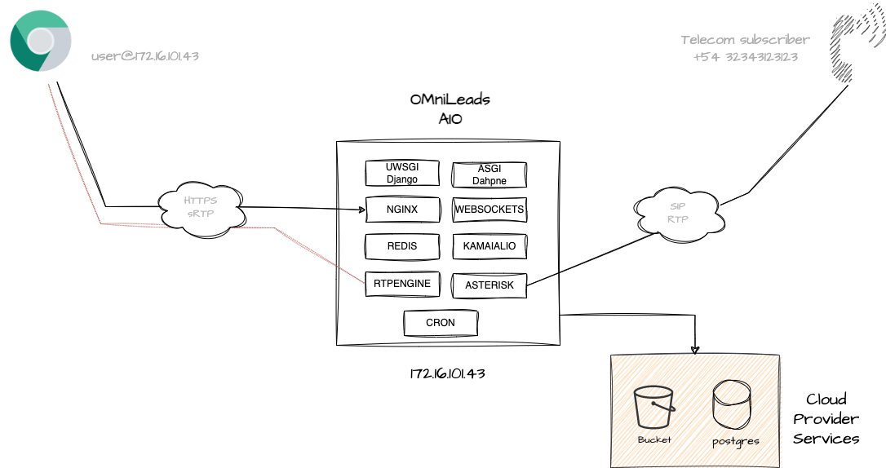
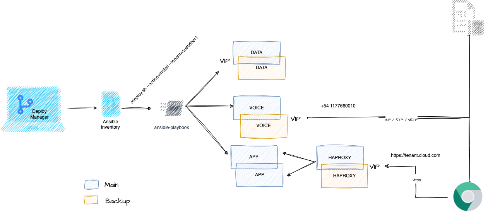
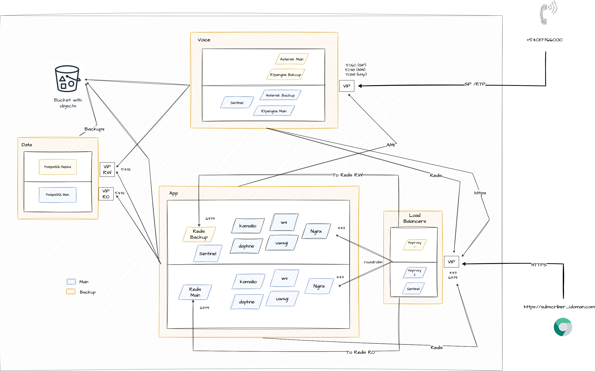
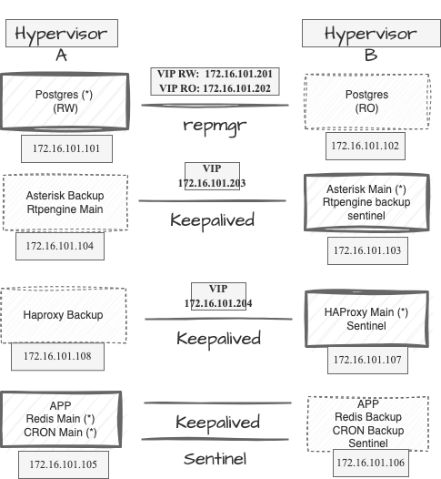

It should be invoked when deploying OMniLeads under an On-Premise High Availability scheme, based on two physical servers (hypervisors) with 8 VMs on which the components are distributed.


# Deploy an OMniLeads AIO or AIT instance with Postgres DB and Bucket Object Storage as the cloud provider service. 🚀 <a name="onpremise-deploy"></a>

It is possible to deploy the application using external cloud services for both Postgres and Bucket. The majority of cloud infrastructure providers offer the possibility of requesting an instance with Postgres installed in addition to the Linux instances (VPS). Similarly, object storage can be requested as a service, generating a bucket for our deployment. This approach is very interesting because we consider the OMniLeads instance to be stateless, ephemeral, and fully viable within the perspective of immutable infrastructure.

So, You must have a Linux instance , as Ansible needs to establish an SSH connection using the public key. Additionally, you will need to have access to the object storage bucket and its access keys, as well as the connection details for the PostgreSQL database instances.



We are going to propose a reference inventory, where the cloud provider is supposed to give us the connection data to Postgres.
The parameter *postgres_host* must be assigned the corresponding connection string.
Then it is simply a matter of adjusting the other connection parameters, according to whether we are going to need to establish an SSL connection, set the *postgres_ssl: true*
If the PostgreSQL service involves a cluster with more than one node, then it can be activated by *postgres_ha: true* and *postgres_ro_host: X.X.X.X*
to indicate that the queries are impacted on the cluster replica node.

Regarding storage over Object Storage, the URL must be provided in *bucket_url*.
Also the authentication parameters must be provided; *bucket_access_key* & *bucket_secret_key* as well as the *bucket_name*.
Regarding the bucket_region, if you do not need to specify anything, you should leave it with the current value.

Some cloud providers custom parameters:

* Vultr example:

```
postgres_host: vultr-prod-04b0caa5-03fc-402d-95db-de5fb0bbeb1c-vultr-prod-a539.vultrdb.com
bucket_url: https://sjc1.vultrobjects.com

# --- PostgreSQL    
postgres_port: 16751
postgres_user: vultradmin
# --- *postgres* or *defaultdb* depend ...
postgres_maintenance_db: defaultdb
postgres_ssl: true
```

* Digital Ocean example:


```
postgres_host: private-oml-pgsql-do-user-6023066-0.b.db.ondigitalocean.com
bucket_url: https://sfo3.digitaloceanspaces.com

# --- PostgreSQL    
postgres_port: 25060
postgres_user: doadmin
# --- *postgres* or *defaultdb* depend ...
postgres_maintenance_db: defaultdb
postgres_ssl: true
```

Finally the deploy is launched:

```
./deploy.sh --action=install --tenant=tenant_name_folder
```

On OML App linux terminal, you must run reset_pass in order to perform a first login in the App.
Once the URL is available with the App returning the login view,  we can log in with the user *admin*, password *admin*.

```
oml_manage --reset_pass
```

# Deploy High Availability onpremise instance 🚀 <a name="cloud-deploy"></a>


We have an inventory file capable of materializing a high availability cluster on 2 Hypervisors (physical servers).  

The cluster essentially replicates all OMniLeads components in such a way that if one of the servers goes down, it can continue to operate by moving the services to the node that is still on.



The postgres, redis, asterisk, rtpengine, haproxy and CRON components are deployed in an Active-Passive scheme, i.e. there is one node that processes requests while the other remains in standby or Read Only state (in the case of Postgres, asterisk, rtpengine, haproxy and CRON). 
node that processes the requests while the other remains in standby or Read Only state (for Postgres).

In this deployment format, OMniLeads needs a load balancing stage to receive the Web requests.
and distribute them under some algorithm on the two instances (one VM on each hypervisor node) of the application that are executed.

On the side of the Web components (uwsgi, websockets, nginx, kamailio and daphne) they are arranged in an Active-Active format being 
Haproxy does the HTTP request balancing on both Active instances. 

There should be 8 virtual machines distributed under the following scheme:

* **Hypervisor A:** App + Redis Main, Postgres Main, Voice Backup
* **Hypervisor B:** App + Redis Backup, Postgres Backup, Voice Main




* Redis: Sentinel, who is the cluster manager, is used. He promotes on the basis of a logic the role of each Redis.
* Postgres: repmgr is used, which is the cluster director. Who promotes on a logical basis the role of each Postgres.
* Asterisk: Keepalived is used in order to supervise the active node and in case of a fall of the same one, to raise the Virtual IP (VIP) on the Failover node.
* HAProxy: Keepalived is used in order to monitor the active node and in case of node downtime, raise the Virtual IP (VIP) on the Failover node.
* Web Application: these nodes run as Active-Active, i.e. there are two instances of App running and attending requests based on the balancing that Haproxy carries out in a previous stage. 


>  Note: Access to an external Object Storage bucket is required. That is to say that the installation of OMniLeads
>in HA does not contemplate the deployment of MinIO Object Storage for now, so it is necessary to have the bucket and its access keys in order to continue with a high >availability deployment of the of the App in high availability, it is necessary to have the bucket and its access keys.


### Let's deploy !

You must to generate the tenant folder and put here an inventory.yml file, for example:

```
mkdir instances/my_subscriber_003
cp inventory_ha.yml instances/my_subscriber_003/inventory.yml
```
(don't forget to generate the inventory.yml file from the appropriate template for the type of installation you want to deploy: _aio or _ait, or _ha)

To deploy our cluster we must have 2 VMs with CentOS7 (for the Postgres cluster) on one side and 6 VMs with Debian11 (or ubuntu-22.04 or rocky linux 8) to build the App, Voice and Load balancer clusters. 

Let's assume the following distribution of components on the VMs and IP configuration:

```
VM data RW: 172.16.101.101 (Hypervisor A)
VM data RO: 172.16.101.102 (Hypervisor B)
VM voice main: 172.16.101.103 (Hypervisor B)
VM voice backup: 172.16.101.104 (Hypervisor A)
VM app+redis main: 172.16.101.105 (Hypervisor A)
VM app+redis backup: 172.16.101.106 (Hypervisor B)
VM haproxy main: 172.16.101.107 (Hypervisor B)
VM haproxy backup: 172.16.101.108 (Hypervisor A)

VIP postgres RW: 172.16.101.201
VIP postgres RO: 172.16.101.202
VIP voice_host: 172.16.101.203
VIP haproxy_host: 172.16.101.204
```

Then, as an example, we will continue with the IPs proposed at the time of creating the inventory file.

```
---


```

> Note: Remember that all VMs must have the ssh key of our deployer: **ssh-copy-id root@....**.

Finallly:

```
./deploy.sh --action=install --tenant=tenant_name_folder
```

The layout of the components contemplates the execution of both the RW node of postgres and redis on the hypervisor A, 
while the active node of Asterisk and Haproxy on hypervisor B.



Therefore we have a failover if the Hypervisor-A crashes then the Postgres-RW and Redis-RW components fail over to Hypervisor-B.
on Hypervisor-B. While if Hypervisor-B goes down the Haproxy-active and Asterisk-active components execute a failover on Hypervisor-A. 
failover to Hypervisor-A.

On OML App linux terminal, you must run reset_pass in order to perform a first login in the App.
Once the URL is available with the App returning the login view,  we can log in with the user *admin*, password *admin*.

```
oml_manage --reset_pass
```


### **Recovery Postgres main node**

When a Failover from Postgres Main to Postgres Backup occurs, then the Backup node takes the floating IP of the cluster and remains as the only RW/RO node with its corresponding IPs. 
as the only RW/RO node with its corresponding IPs. 

To return Postgres to the initial state two actions must be carried out:

```
./deploy.sh --action=pgsql_node_recovery_main --tenant=tenant_name_folder
```

This command is in charge of rejoining the Postgres Main node to the cluster. But if we only execute this action then 
the Cluster will be inverted, i.e. Postgres B as main and Postgres A as backup.

### **Takeover Postgres main node**


This command implies that a Recovery has been previously executed as described in the previous step.

```
./deploy.sh --action=pgsql_node_takeover_main --tenant=tenant_name_folder
```

After the execution of the takeover we will have the cluster in the initial state, i.e. Postgres A as Main and Postgres B as backup.

### **Takeover Redis main node**


A last action to be taken has to do with the takeover of the Redis node, in such a way that we leave the Redis cluster in the initial state, i.e. Redis A as main and Redis B as backup, that is to say Redis A as main and Redis B as backup.

```
./deploy.sh --action=redis_node_takeover_main --tenant=tenant_name_folder
```

### **Recovery Postgres backup node**

When the VM hosting the Postgres Backup node shuts down, the Main node takes the floating RO IP of the cluster and remains as the only RW/RO node with its corresponding IPs. as the only RW/RO node with its corresponding IPs. To rejoin the backup node to the cluster and in this way recover the RO's VIP, it is necessary to run a
the RO VIP, a recovery deploy of the postgres backup node must be executed.

```
./deploy.sh --action=pgsql_node_recovery_backup --tenant=tenant_name_folder
```


# Post-installation steps :beer:

It is also possible to generate a test environment by calling:

```
oml_manage --init_env
```

Where some users, routes, trunks, forms, breaks, etc. are generated.

From then on we can log in with the agent type user *agent*, password *agent1**.

