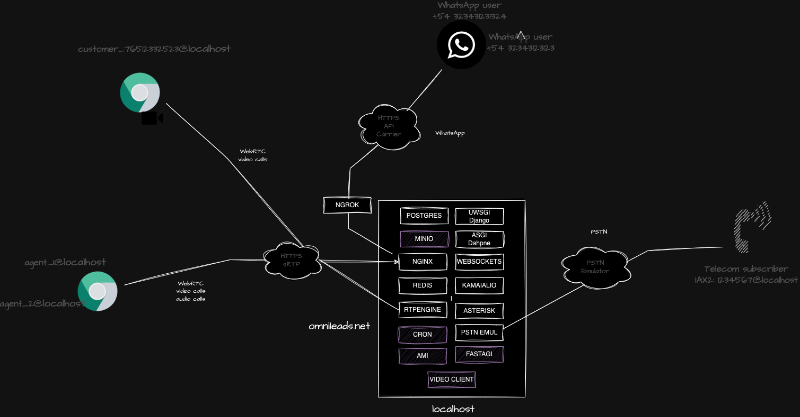

#### This project is part of OMniLeads


#### 100% Open-Source Contact Center Software
#### [Community Forum](https://forum.omnileads.net/)

---
# Index

* [Requirements](#requirements)
* [Docker Desktop](#docker_desktop)
* [First login](#post_install)
* [Simulate calls](#pstn_emulator)
* [Predictive dialer](#wombat_dialer)
* [OMniLeads interaction tool](#oml_manage)

You need docker installed (on Linux, Mac or Windows) and this reposotory cloned <a name="requirements"></a>

* [Docker Install documentation](https://docs.docker.com/get-docker/)

```
git clone https://gitlab.com/omnileads/omldeploytool.git
cd omldeploytool/docker-compose-qa
```

## Setup your environment

You need to create a .env file by using (cp) the environment file provided here.

### **Workstation Docker-Desktop deploy** <a name="docker_desktop"></a>

You don't need to work with the variables file, you can simply proceed with the instance execution through the command:

```
$ docker-compose up -d 
```




## Deploy on linux VM

You should have a Linux virtual machine with the capability to run Docker.


```
ssh root@your_vm_host
curl -o deploy.sh -L "https://gitlab.com/omnileads/omldeploytool/-/raw/main/docker-compose-qa/deploy.sh" && chmod +x deploy.sh
export BRANCH=main && ./deploy.sh
```

## Log in to the Admin UI <a name="post_install"></a>

Before first time you login must to exec:

```
./oml_manage --reset_pass
```

Then acces the URL with your browser 

https://localhost or https://your_VM_VPS

Default Admin User & Pass:

```
admin
admin
```

Finally  you can choice a custom password. 

## The oml_manage script

This is used to launch some administration actions like, read containers logs, delete postgres logs tables and more. 

```
./oml_oml_manage --help
```

## Create some testing data

```
./oml_manage --init_env
```

Users:

```
ag1
ag2
gerente
```

For all users the pass is:

```
usuario0*
```

## Simulate calls from/to PSTN (Only on Docker-Desktop scenary) <a name="pstn_emulator"></a>

Adittionally with omnileads container is the pstn-emulator, this an emulation of a PSTN provider,
so you can make calls via Omnileads and have different results of the call based on what you dialed
as well as generate calls from the command line to OMniLeads inbound routes.

##### Dialplan outbound rules:

* Any number dialed finished with 0: PSTN is going to send you a BUSY signal
* Any number dialed finished with 1: PSTN is going to answer your call and playback audios
* Any number dialed finished with 2: PSTN will anwer your call, play short audio then hangup. This will emulate a calle hangup
* Any number dialed finished with 3: PSTN will answer your call after 35 seconds
* Any number dialed finished with 5: PSTN will make you wait 120 seconds and then hangup. This will emulate a NO_ANSWER
* Any number dialed finished with 9: PSTN will simulate a congestion

##### Generate inbound calls to omnileads stack:

```
./oml_manage --call_generate
```

This actions will make an inbound call to the default inbound campaign created from testing data. 
You can attend the call and listen some cool music, then the recordings appear on the recordings search views. 

##### Register your SIP softphone to test the stack 

You can register a SIP account on pstn-emulator container in order to play with OMniLeads and the softphone you want. 

This are the SIP account credentials:

username: 1234567
secret: omnileads
domain: YOUR_HOSTNAME
(Change "YOUR_HOSTNAME" with the VM hostname/IPADDR  or localhost)

Then you can send calls to DID 01177660010, an also send calls from an agent to this SIP account phone calling 1234567.

## Configuring wombat dialer <a name="wombat_dialer"></a>

You only need to do this if you are going to work with Predictive Dialer campaigns.

Wombat Dialer is a third-party software and not part of the FLOSS stack of OMniLeads. However, it is a valid option for implementing predictive dialing campaign logic.

The docker-compose.yml includes the Wombat Dialer & MariaDB service (its SQL backend), so it is simply available for configuration and integration by accessing https://localhost:8082.

Note: when configuring initial mariadb credentials the root pass is ***admin123***, then on the AMI connection, the server address is ***acd***.

The **production** scenarios do not implement Wombat Dialer by default, so if you want to implement Wombat Dialer in production, you will need to have a VM/VPS to install the dialer there and then configure it to work with OMniLeads.

Check our official documentation to check this: https://www.wombatdialer.com/installation.jsp

## OMniLeads interaction tool <a name="oml_manage"></a>

In this directory, we have the script "oml_manage," which allows us to perform various actions such as clearing cache, deleting the database, launching the Django shell, invoking the Asterisk CLI, etc.

For more options:

```
./oml_manage --help
```


## Video calls <a name="oml_video"></a>

https://localhost