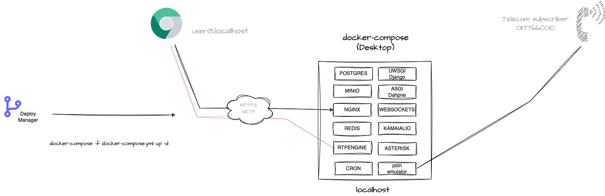
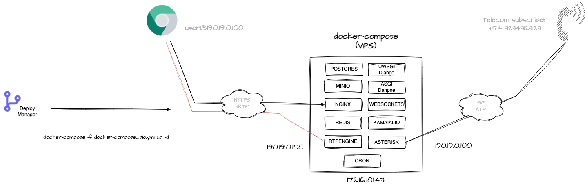
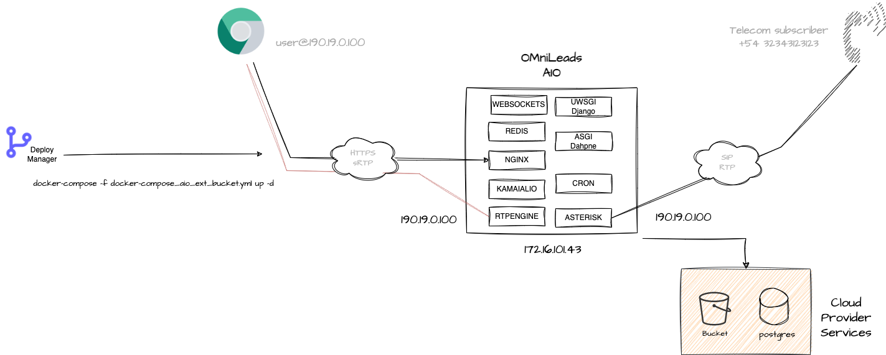
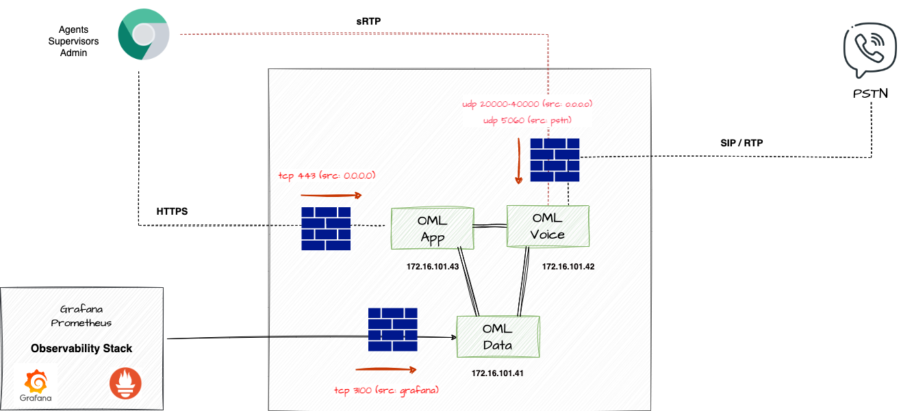

#### This project is part of OMniLeads


#### 100% Open-Source Contact Center Software
#### [Community Forum](https://forum.omnileads.net/)

---
You need docker installed and this reposotory cloned

* [Docker Install documentation](https://docs.docker.com/get-docker/)

```
git clone https://gitlab.com/omnileads/omldeploytool.git
cd omldeploytool/docker-compose
```

# OMniLeads & Docker Compose

In this folder, we will find three Docker Compose files.

* **docker-compose.yml**: is used to launch the stack on the workstation with Docker Desktop.
* **docker-compose_aio.yml**: is used to launch the stack on a VPS or VM."
* **docker-compose_aio_ext_bucket.yml**: is used to launch the stack on a VPS or VM and using an external bucket

## Setup your environment

You need to create a .env file by using (cp) the environment file provided here.

### **Workstation Docker-Desktop deploy**

You don't need to work with the variables file, you can simply proceed with the instance execution through the command:

```
$ docker-compose up -d
```




### **Onpremise Virtual Machine or Cloud VPS**

You can use docker-compose to run an instance of OMniLeads on a Virtual Machine or VPS (cloud). However, some configuration work with the .env file may be necessary.

>  Note: If working on a VPS with a public IP address, it is a mandatory requirement that it also has a network interface with the ability to associate a private IP address.

* To begin with, it's important to specify the scenario we'll be working with, which will be cloud if we're working on a VPS, and lan if we're using an on-premise Virtual Machine.

```
ENV=cloud
```
or

```
ENV=lan
```

* The hostname of each component must be modified

```
DJANGO_HOSTNAME=localhost
DAPHNE_HOSTNAME=localhost
ASTERISK_HOSTNAME=10.10.10.2
WEBSOCKET_HOSTNAME=localhosts
WEBSOCKET_REDIS_HOSTNAME=redis://localhost:6379
PGHOST=localhost
OMNILEADS_HOSTNAME=10.10.10.2
RTPENGINE_HOSTNAME=10.10.10.2
REDIS_HOSTNAME=localhost
KAMAILIO_HOSTNAME=localhost
```

* Finally, we must indicate to the App the URL to invoke the internal bucket, using an fqdn or an IP. If an IP is used, and we are deploying on a cloud environment, a Public IP should be used, while if the environment is LAN, a Private IP should be used.

LAN:
```
S3_ENDPOINT=https://10.10.10.2
S3_ENDPOINT_MINIO=http://localhost:9000
```

Cloud:
```
S3_ENDPOINT=https://190.19.122.2
S3_ENDPOINT_MINIO=http://localhost:9000
```

Now, let's proceed to launch the stack:

```
$ docker-compose -f docker-compose_aio.yml up -d
```



### **Onpremise Virtual Machine and VPS Cloud deploy with external bucket**

For this scenario, we consider all the modifications executed in the previous item, except that here we need to take into account some issues regarding the bucket variables.

>  Note: If working on a VPS with a public IP address, it is a mandatory requirement that it also has a network interface with the ability to associate a private IP address.

* The variable must be modified so that it becomes:

```
CALLREC_DEVICE=s3
```

* The endpoint URL and access parameters must be specified. For example:

```
S3_ENDPOINT=https://sfo3.digitaloceanspaces.com
S3_BUCKET_NAME=omnileads
AWS_ACCESS_KEY_ID=ojkghjkhjkh4jk23h4jk23hjk4
AWS_SECRET_ACCESS_KEY=HJGGH675675hjghjgHJGHJg67567HJHVHJGdsaddadakjhjk
```

Now, let's proceed to launch the stack:

```
$ docker-compose -f docker-compose_aio_ext_bucket.yml up -d
```



## Log in to the Admin UI

Before first time you login must to exec:

```
./oml_manage --reset_pass
```

Then acces the URL with your browser 

https://localhost or https://your_VM_VPS

Default Admin User & Pass:

```
admin
admin
```

Finally  you can choice a custom password. 

## Create some testing data

```
./oml_manage --init_env
```

Default Agent User & Pass:

```
agent
agent1*
```

## Simulate calls from/to PSTN (Only on Docker-Desktop scenary)

Adittionally with omnileads container is the pstn-emulator, this an emulation of a PSTN provider,
so you can make calls via Omnileads and have different results of the call based on what you dialed
as well as generate calls from the command line to OMniLeads inbound routes.


##### Dialplan outbound rules:

* Any number dialed finished with 0: PSTN is going to send you a BUSY signal
* Any number dialed finished with 1: PSTN is going to answer your call and playback audios
* Any number dialed finished with 2: PSTN will anwer your call, play short audio then hangup. This will emulate a calle hangup
* Any number dialed finished with 3: PSTN will answer your call after 35 seconds
* Any number dialed finished with 5: PSTN will make you wait 120 seconds and then hangup. This will emulate a NO_ANSWER
* Any number dialed finished with 9: PSTN will simulate a congestion

##### Generate inbound calls to omnileads stack:

```
./oml_manage --generate_call
```

This actions will make an inbound call to the default inbound campaign created from testing data. 
You can attend the call and listen some cool music, then the recordings appear on the recordings search views. 

##### Register your SIP softphone to test the stack 

You can register a SIP account on pstn-emulator container in order to play with OMniLeads and the softphone you want. 

This are the SIP account credentials:

username: 1234567
secret: omnileads
domain: YOUR_HOSTNAME
(Change "YOUR_HOSTNAME" with the VM hostname/IPADDR  or localhost)

Then you can send calls to DID 01177660010, an also send calls from an agent to this SIP account phone calling 1234567.

## The oml_manage script

This is used to launch some administration actions like, read containers logs, delete postgres logs tables and more. 

```
./oml_oml_manage --help
```

## Configuring wombat dialer

You only need to do this if you are going to work with Predictive Dialer campaigns

When you enter to http://localhost:8082 or http://hostname-or-ipaddr:8082 you go to Wombat Dialer to begin its configuration. 

Check our official documentation to check this: https://documentacion-omnileads.readthedocs.io/es/stable/maintance.html#configuracion-del-modulo-de-discador-predictivo

Note: when configuring initial mariadb credentials the root pass is admin123, then on the AMI connection, the server address is acd.


# Security 

OMniLeads is an application that combines Web (https), WebRTC (wss & sRTP) and VoIP (SIP & RTP) technologies. This implies a certain complexity and 
when deploying it in production under an Internet exposure scenario. 

On the Web side of the things the ideal is to implement a Reverse Proxy or Load Balancer ahead of OMnileads, i.e. exposed to the Internet (TCP 443) 
and that it forwards the requests to the Nginx of the OMniLeads stack. On the VoIP side, when connecting to the PSTN via VoIP it is ideal to 
operate behind an SBC (Session Border Controller) exposed to the Internet.

However, we can intelligently use the **Cloud Firewall** technology when operating over VPS exposed to the Internet.



Below are the Firewall rules to be applied on All In One instance:

* 443/tcp Nginx: This is where Web/WebRTC requests to Nginx are processed. Port 443 can be opened to the entire Internet.

* 40000/50000 UDP: WebRTC sRTP RTPengine: this port range can be opened to the entire Internet.

* 5060/UDP Asterisk: This is where SIP requests for incoming calls from the ITSP(s) are processed. This port must be opened by restricting by origin on the IP(s) of the PSTN SIP termination provider(s).

* 20000/30000 UDP VoIP RTP Asterisk: this port range can be opened to the entire Internet.

* 9100/tcp Prometheus node exporter : This is where the connections coming from the monitoring center, more precisely from Prometheus, are processed. This port can be opened by restricting by origin in the IP of the monitoring center.

* 3100/TCP Loki: this is where the connections coming from the monitoring center are processed, more precisely from Grafana, are processed. This port can be opened by restricting by origin on the IP of the monitoring center.


## Destroy and re-create all PostgreSQL backend

If you want *reset to fresh install* status launch (with the stack operative):

```
./oml_oml_manage --clean_postgresql_db
```

Then login with *admin*, *admin* and create a new password. 
