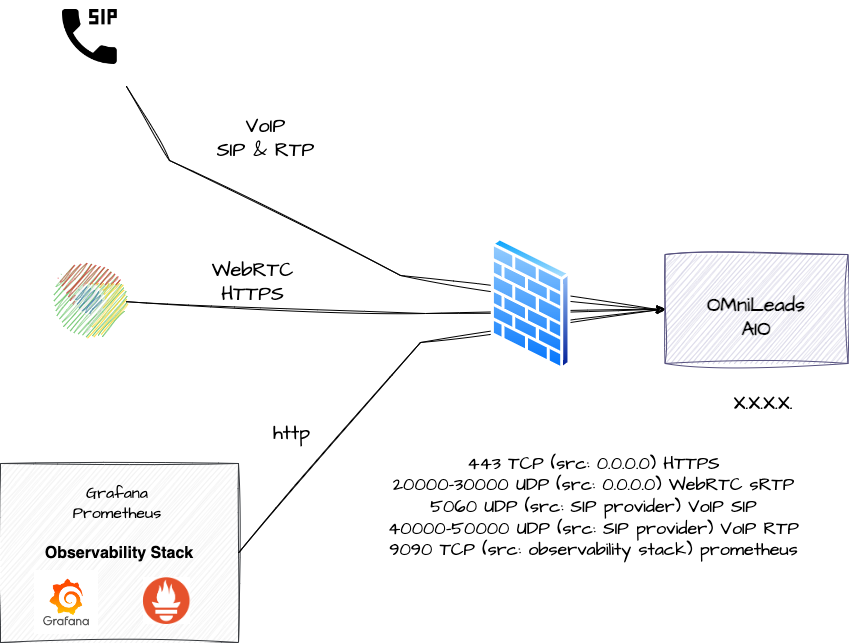
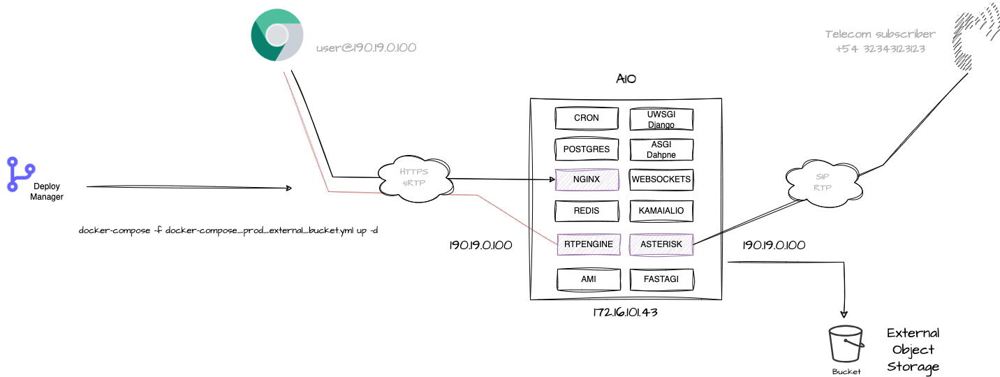

#### This project is part of OMniLeads


#### 100% Open-Source Contact Center Software

#### [Community discord](https://discord.gg/FEDkVmSQ)

---
# Index

* [Requirements](#requirements)
* [Develpment environment](#dev-env)
* [Quick localhost test environment](#test-env)
* [Cloud VPS or Onpremise VM](#prod-env)
* [Security](#security)
* [First login](#post_install)
* [OMniLeads Eneterprise](#oml_enterprise)
* [OMniLeads interaction tool](#oml_manage)
* [Simulate calls (only for docker-desktop ENV)](#pstn_emulator)
* [Predictive dialer setting (only for docker-desktop ENV)](#wombat_dialer)

You need docker & docker-compose installed (on Linux, Mac or Windows) and this reposotory cloned <a name="requirements"></a>

* [Docker Install documentation](https://docs.docker.com/get-docker/)

```
git clone https://gitlab.com/omnileads/omldeploytool.git
cd omldeploytool/docker-compose
```

# OMniLeads & Docker Compose 

In this folder, we will find three Docker Compose environments.

* **dev-env**: is used to launch the deveelopment stack on sthe workstation with Docker Desktop"
* **test-env**: is used to launch the stack on the workstation with Docker Desktop.
* **prod-env**: is used to launch the stack on a VPS or VM."

### **Workstation Docker-Desktop dev-env deploy** <a name="dev-env"></a>

In this environment, the Django application runs using the framework's development mode. Additionally, Docker binding is used to mount the code of each component into its respective container.

With the following sequence of commands, you will have an environment ready to start using your development setup:

```
./download_oml_repos.sh --gitlab_clone=https | ssh
cp env dev-env/.env
cd dev-env
ln -s ../oml_manage ./
docker-compose build
docker-compose up -d
docker-compose exec -it django_app python manage.py cambiar_admin_password
docker-compose exec -it django_app python manage.py inicializar_entorno
```

Once the environment is up, you can proceed to log in at https://localhost using the username admin and password admin

### **Workstation Docker-Desktop test-env deploy** <a name="test-env"></a>

This environment is ideal for quickly testing the application locally. It is not recommended for production.

```
cp env test-env/.env
cd dev-env
ln -s ../oml_manage ./
docker-compose up -d
docker-compose exec -it django_app python manage.py cambiar_admin_password
docker-compose exec -it django_app python manage.py inicializar_entorno
```

Una vez arriba el entorno puede avanzar con el login sobre https://localhost utilizando el user admin y password admin.

# Security  <a name="security"></a>

OMniLeads is an application that combines Web (https), WebRTC (wss & sRTP) and VoIP (SIP & RTP) technologies. This implies a certain complexity and 
when deploying it in production under an Internet exposure scenario. 

On the Web side of the things the ideal is to implement a Reverse Proxy or Load Balancer ahead of OMnileads, i.e. exposed to the Internet (TCP 443) 
and that it forwards the requests to the Nginx of the OMniLeads stack. On the VoIP side, when connecting to the PSTN via VoIP it is ideal to 
operate behind an SBC (Session Border Controller) exposed to the Internet.

However, we can intelligently use the **Cloud Firewall** technology when operating over VPS exposed to the Internet.



Below are the Firewall rules to be applied on All In One instance:

* 443/tcp Nginx: This is where Web/WebRTC requests to Nginx are processed. Port 443 can be opened to the entire Internet.

* 20000/30000 UDP WebRTC sRTP RTPengine: this port range can be opened to the entire Internet.

* 5060/UDP Asterisk: This is where SIP requests for incoming calls from the ITSP(s) are processed. This port must be opened by restricting by origin on the IP(s) of the PSTN SIP termination provider(s).

* 40000/50000 UDP: VoIP RTP Asterisk: this port range can be opened to the entire Internet.

* 9090/tcp Prometheus metrics: This is where the connections coming from the monitoring center. This port can be opened by restricting by origin in the IP of the monitoring center.

### **Onpremise Virtual Machine or Cloud VPS** <a name="vps_vm"></a>

This environment is ideal for quickly testing the application locally. It is not recommended for production.

```
curl -o deploy.sh -L "https://gitlab.com/omnileads/omldeploytool/-/raw/oml-2679-dev-discador-oml/docker-compose/prod-env/deploy.sh?ref_type=heads" && chmod +x deploy.sh
```

Una vez disponible el script de deploy.sh, pasamos a invicarlo.

```
export NIC=eth1 ENV=docker-compose && ./deploy.sh
```

Los parametros NIC y ENV refieren a la interfaz de red que llevara la IP 

You can deploy it manually .....

```
cp env prod-env/.env
```

En el .env se debe setear los parametros:

```
PUBLIC_IP=$YOUR_PUBLIC_ADDR
PRIVATE_IP=$YOUR_LAN_ADDR
ENV=docker-compose
```

Luego se lanzan los siguientes comandos de iptables en pos de reenviar los puertos UDP correspondientes al audio (RTP) hacia los contenedores ACD y RTPENGINE.

```
iptables -t nat -A PREROUTING -p udp --dport 5060 -j DNAT --to-destination 10.22.22.99
iptables -A FORWARD -p udp -d 10.22.22.99 --dport 5060 -j ACCEPT
iptables -t nat -A PREROUTING -p udp --dport 40000:50000 -j DNAT --to-destination 10.22.22.99
iptables -A FORWARD -p udp -d 10.22.22.99 --dport 40000:50000 -j ACCEPT
iptables -t nat -A PREROUTING -p udp --dport 20000:30000 -j DNAT --to-destination 10.22.22.98
iptables -A FORWARD -p udp -d 10.22.22.98 --dport 20000:30000 -j ACCEPT

```

```
cd prod-env
ln -s ../oml_manage ./
docker-compose up -d
./oml_manage --reset_pass
```

Una vez arriba el entorno puede avanzar con el login sobre https://your_linux_host_ip utilizando el user admin y password admin.

>  Note: If working on a VPS with a public IP address, it is a mandatory requirement that it also has a network interface with the ability to associate a private IP address.

### **Onpremise Virtual Machine and VPS Cloud deploy with external bucket & postgres DB**

>  Note: If working on a VPS with a public IP address, it is a mandatory requirement that it also has a network interface with the ability to associate a private IP address.

The endpoint URL and access parameters must be specified. For example:

```
S3_ENDPOINT=https://sfo3.digitaloceanspaces.com
S3_BUCKET_NAME=omnileads
AWS_ACCESS_KEY_ID=ojkghjkhjkh4jk23h4jk23hjk4
AWS_SECRET_ACCESS_KEY=HJGGH675675hjghjgHJGHJg67567HJHVHJGdsaddadakjhjk

```
You can invoke the docker-compose with:

```
$ docker-compose up -d
```



## Log in to the Admin UI <a name="post_install"></a>

Before first time you login must to exec:

```
./oml_manage --reset_pass
```

Then acces the URL with your browser 

https://localhost or https://your_VM_VPS

Default Admin User & Pass:

```
admin
admin
```

Finally  you can choice a custom password. 

## OMniLeads Enterprise <a name="oml_enterprise"></a>

What is OMniLeads Enterprise?

It is an additional layer with complementary modules to OMniLeads Community (GPLV3). It includes functionalities such as advanced reports, wallboards, and automated satisfaction surveys implemented as modules.

This version can be implemented simply by referencing the image for the container that implements the web application.
Therefore, in our ".env" variable file, we must invoke the Enterprise image. To do this, we add the string "-enterprise" to the end of the tag that describes the image of the OMLAPP_IMG component:

```
OMLAPP_IMG=${REPO}/omlapp:240117.01-enterprise
```

Finally, we run the command:
If you are using Docker Desktop on localhost:

```
docker-compose up -d --force-recreate django_app nginx
```

## The oml_manage script <a name="oml_manage"></a>

This is used to launch some administration actions like, read containers logs, delete postgres logs tables and more. 

```
./oml_oml_manage --help
```

## Create some testing data

```
./oml_manage --init_env
```

Users:

```
ag1
ag2
gerente
```

For all users the pass is:

```
usuario0*
```

## Simulate calls from/to PSTN (Only on Docker-Desktop scenary) <a name="pstn_emulator"></a>

Adittionally with omnileads container is the pstn-emulator, this an emulation of a PSTN provider,
so you can make calls via Omnileads and have different results of the call based on what you dialed
as well as generate calls from the command line to OMniLeads inbound routes.

##### Dialplan outbound rules:

* Any number dialed finished with 0: PSTN is going to send you a BUSY signal
* Any number dialed finished with 1: PSTN is going to answer your call and playback audios
* Any number dialed finished with 2: PSTN will anwer your call, play short audio then hangup. This will emulate a calle hangup
* Any number dialed finished with 3: PSTN will answer your call after 35 seconds
* Any number dialed finished with 5: PSTN will make you wait 120 seconds and then hangup. This will emulate a NO_ANSWER
* Any number dialed finished with 9: PSTN will simulate a congestion

##### Generate inbound calls to omnileads stack:

```
./oml_manage --call_generate
```

This actions will make an inbound call to the default inbound campaign created from testing data. 
You can attend the call and listen some cool music, then the recordings appear on the recordings search views. 

##### Register your IAX2 softphone to test the stack 

You can register a IAX2 account on pstn-emulator container in order to play with OMniLeads and the softphone you want. 

This are the IAX2 account credentials:

```
username: 1234567
secret: omnileads
domain: YOUR_HOSTNAME
```

(Change "YOUR_HOSTNAME" with the VM hostname/IPADDR  or localhost)

Then you can send calls to DID 01177660010 to 01177660015, an also send calls from an agent to this IAX2 account phone calling 1234567.
