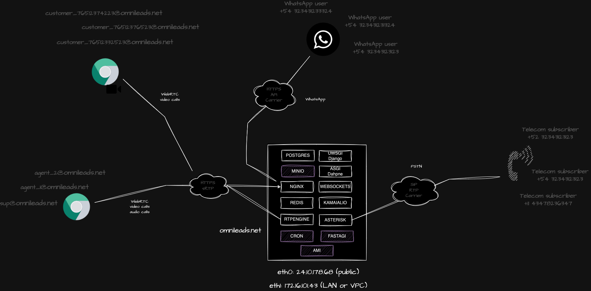

#### This project is part of OMniLeads


#### 100% Open-Source Contact Center Software

#### [Community discord](https://discord.gg/FEDkVmSQ)

---
# Index

* [Requirements](#requirements)
* [Docker Desktop](#docker_desktop)
* [Security](#security)
* [Cloud VPS or Onpremise VM](#vps_vm)
* [First login](#post_install)
* [OMniLeads Eneterprise](#oml_enterprise)
* [OMniLeads interaction tool](#oml_manage)
* [Simulate calls (only for docker-desktop ENV)](#pstn_emulator)
* [Predictive dialer setting (only for docker-desktop ENV)](#wombat_dialer)

You need docker installed (on Linux, Mac or Windows) and this reposotory cloned <a name="requirements"></a>

* [Docker Install documentation](https://docs.docker.com/get-docker/)

```
git clone https://gitlab.com/omnileads/omldeploytool.git
cd omldeploytool/docker-compose
```

# OMniLeads & Docker Compose 

In this folder, we will find three Docker Compose files.

* **docker-compose.yml**: is used to launch the stack on the workstation with Docker Desktop.
* **docker-compose_prod.yml**: is used to launch the stack on a VPS or VM."
* **docker-compose_prod_external_bucket.yml**: is used to launch the stack on a VPS or VM and using an external bucket

## Setup your environment

You need to create a .env file by using (cp) the environment file provided here.

### **Workstation Docker-Desktop deploy** <a name="docker_desktop"></a>

You don't need to work with the variables file, you can simply proceed with the instance execution through the command:

```
$ docker-compose up -d 
```


# Security  <a name="security"></a>

OMniLeads is an application that combines Web (https), WebRTC (wss & sRTP) and VoIP (SIP & RTP) technologies. This implies a certain complexity and 
when deploying it in production under an Internet exposure scenario. 

On the Web side of the things the ideal is to implement a Reverse Proxy or Load Balancer ahead of OMnileads, i.e. exposed to the Internet (TCP 443) 
and that it forwards the requests to the Nginx of the OMniLeads stack. On the VoIP side, when connecting to the PSTN via VoIP it is ideal to 
operate behind an SBC (Session Border Controller) exposed to the Internet.

However, we can intelligently use the **Cloud Firewall** technology when operating over VPS exposed to the Internet.


Below are the Firewall rules to be applied on All In One instance:

* 443/tcp Nginx: This is where Web/WebRTC requests to Nginx are processed. Port 443 can be opened to the entire Internet.

* 20000/30000 UDP WebRTC sRTP RTPengine: this port range can be opened to the entire Internet.

* 5060/UDP Asterisk: This is where SIP requests for incoming calls from the ITSP(s) are processed. This port must be opened by restricting by origin on the IP(s) of the PSTN SIP termination provider(s).

* 40000/50000 UDP: VoIP RTP Asterisk: this port range can be opened to the entire Internet.

* 9090/tcp Prometheus metrics: This is where the connections coming from the monitoring center. This port can be opened by restricting by origin in the IP of the monitoring center.


### **Onpremise Virtual Machine or Cloud VPS** <a name="vps_vm"></a>

>  Note: If working on a VPS with a public IP address, it is a mandatory requirement that it also has a network interface with the ability to associate a private IP address.

The first_boot_installer.sh script can be used to deploy to a debian-based or red-hat linux clean instance.

For example:

```
curl -o first_boot_installer.sh -L "https://gitlab.com/omnileads/omldeploytool/-/raw/main/docker-compose/first_boot_installer.sh" && chmod +x first_boot_installer.sh
```

Without dialer:

```
export NIC=eth0 ENV=lan && ./first_boot_installer.sh
```


#### Deploying a specific version of OMniLeads:

There may be a need to deploy a specific release of the app. For this purpose, the BRANCH parameter can be used by adding BRANCH=release-1.33.2.

```
export NIC=eth0 BRANCH=release-1.33.2 ENV=cloud && ./first_boot_installer.sh)
```

#### NAT Environments:

It may be necessary to deploy the app behind some type of NAT where we want to explicitly specify the IP address that will traverse the NAT. For this, the parameter NAT_IPV4=xxx.xxx.xxx or NAT_IPV4=tenant.example.com can be added. If no NAT IP is specified, the script will resolve to assign the public IP detected using curl.

```
export NIC=eth0 ENV=nat NAT_IPV4=182.333.20.12 && ./first_boot_installer.sh)
```

#### Deploying with Wombat Dialer integration.

```
export  NIC=eth0 ENV=lan DIALER_HOST=X.X.X.X DIALER_USER=demo DIALER_PASS=demoadmin && ./first_boot_installer.sh
```

You must to specify the private ipv4 NIC and scenario (ENV) we'll be working with, which will be cloud if we're working on a VPS (cloud), and lan if we're using an on-premise Virtual Machine (lan).
The BUCKE_NAME=NULL is necesary in order to work with the minio (localhost) object storage.

You can invoke the docker-compose with:

```
$ docker-compose -f docker-compose_prod.yml up -d
```



### **Onpremise Virtual Machine and VPS Cloud deploy with external bucket & postgres DB**

>  Note: If working on a VPS with a public IP address, it is a mandatory requirement that it also has a network interface with the ability to associate a private IP address.

>  Note: If working on a VPS with a public IP address, it is a mandatory requirement that it also has a network interface with the ability to associate a private IP address.

The first_boot_installer.sh script can be used to deploy to a debian-based clean instance.

For example:

```
curl -o first_boot_installer.sh -L "https://gitlab.com/omnileads/omldeploytool/-/raw/main/docker-compose/first_boot_installer.sh" && chmod +x first_boot_installer.sh
```

Without dialer:

```
export NIC=eth1 ENV=cloud BUCKET_URL=https://sfo1.digitaloceanspaces.com BUCKET_ACCESS_KEY=mbXUfdsjlh3424R9XY BUCKET_SECRET_KEY=iicHG76O+CIbRZ432iugdsa BUCKET_REGION=NULL BUCKET_NAME=curso-oml && ./first_boot_installer.sh
```

With dialer:

```
export NIC=eth1 ENV=cloud BUCKET_URL=https://sfo1.digitaloceanspaces.com BUCKET_ACCESS_KEY=mbXUfdsjlh3424R9XY BUCKET_SECRET_KEY=iicHG76O+CIbRZ432iugdsa BUCKET_REGION=NULL BUCKET_NAME=curso-oml DIALER_HOST=X.X.X.X DIALER_USER=demo DIALER_PASS=demoadmin && ./first_boot_installer.sh
```

You must to specify the private ipv4 NIC and scenario (ENV) we'll be working with, which will be cloud if we're working on a VPS (cloud), and lan if we're using an on-premise Virtual Machine (lan).
The BUCKE_NAME=NULL is necesary in order to work with the minio (localhost) object storage.

If we look at the .env file, we will see that the variables corresponding to the hostname of each component have been modified:

```
DJANGO_HOSTNAME=localhost
DAPHNE_HOSTNAME=localhost
ASTERISK_HOSTNAME=$PRIVATE_IPV4
WEBSOCKET_HOSTNAME=localhosts
WEBSOCKET_REDIS_HOSTNAME=redis://localhost:6379
PGHOST=localhost
OMNILEADS_HOSTNAME=$PRIVATE_IPV4
RTPENGINE_HOSTNAME=$PRIVATE_IPV4
REDIS_HOSTNAME=localhost
KAMAILIO_HOSTNAME=localhost
```

The endpoint URL and access parameters must be specified. For example:

```
S3_ENDPOINT=https://sfo3.digitaloceanspaces.com
S3_BUCKET_NAME=omnileads
AWS_ACCESS_KEY_ID=ojkghjkhjkh4jk23h4jk23hjk4
AWS_SECRET_ACCESS_KEY=HJGGH675675hjghjgHJGHJg67567HJHVHJGdsaddadakjhjk
```

You can invoke the docker-compose with:

```
$ docker-compose -f docker-compose_prod_external_bucket.yml up -d
```


## Log in to the Admin UI <a name="post_install"></a>

Before first time you login must to exec:

```
./oml_manage --reset_pass
```

Then acces the URL with your browser 

https://localhost or https://your_VM_VPS

Default Admin User & Pass:

```
admin
admin
```

Finally  you can choice a custom password. 

## OMniLeads Enterprise <a name="oml_enterprise"></a>

What is OMniLeads Enterprise?

It is an additional layer with complementary modules to OMniLeads Community (GPLV3). It includes functionalities such as advanced reports, wallboards, and automated satisfaction surveys implemented as modules.

This version can be implemented simply by referencing the image for the container that implements the web application.
Therefore, in our ".env" variable file, we must invoke the Enterprise image. To do this, we add the string "-enterprise" to the end of the tag that describes the image of the OMLAPP_IMG component:

```
OMLAPP_IMG=${REPO}/omlapp:240117.01-enterprise
```

Finally, we run the command:
If you are using Docker Desktop on localhost:

```
docker-compose up -d --force-recreate app nginx
```

If you are using Docker on a VM:

```
docker-compose -f docker-compose_prod.yml up -d --force-recreate app nginx
```

## The oml_manage script <a name="oml_manage"></a>

This is used to launch some administration actions like, read containers logs, delete postgres logs tables and more. 

```
./oml_oml_manage --help
```

## Create some testing data

```
./oml_manage --init_env
```

Users:

```
ag1
ag2
gerente
```

For all users the pass is:

```
usuario0*
```


## Simulate calls from/to PSTN (Only on Docker-Desktop scenary) <a name="pstn_emulator"></a>

Adittionally with omnileads container is the pstn-emulator, this an emulation of a PSTN provider,
so you can make calls via Omnileads and have different results of the call based on what you dialed
as well as generate calls from the command line to OMniLeads inbound routes.

##### Dialplan outbound rules:

* Any number dialed finished with 0: PSTN is going to send you a BUSY signal
* Any number dialed finished with 1: PSTN is going to answer your call and playback audios
* Any number dialed finished with 2: PSTN will anwer your call, play short audio then hangup. This will emulate a calle hangup
* Any number dialed finished with 3: PSTN will answer your call after 35 seconds
* Any number dialed finished with 5: PSTN will make you wait 120 seconds and then hangup. This will emulate a NO_ANSWER
* Any number dialed finished with 9: PSTN will simulate a congestion

##### Generate inbound calls to omnileads stack:

```
./oml_manage --call_generate
```

This actions will make an inbound call to the default inbound campaign created from testing data. 
You can attend the call and listen some cool music, then the recordings appear on the recordings search views. 

##### Register your IAX2 softphone to test the stack 

You can register a IAX2 account on pstn-emulator container in order to play with OMniLeads and the softphone you want. 

This are the IAX2 account credentials:

```
username: 1234567
secret: omnileads
domain: YOUR_HOSTNAME
```

(Change "YOUR_HOSTNAME" with the VM hostname/IPADDR  or localhost)

Then you can send calls to DID 01177660010 to 01177660015, an also send calls from an agent to this IAX2 account phone calling 1234567.


## Configuring wombat dialer (only for docker-desktop scenary) <a name="wombat_dialer"></a>

You only need to do this if you are going to work with Predictive Dialer campaigns.

Wombat Dialer is a third-party software and not part of the FLOSS stack of OMniLeads. However, it is a valid option for implementing predictive dialing campaign logic.

The docker-compose.yml includes the Wombat Dialer & MariaDB service (its SQL backend), so it is simply available for configuration and integration by accessing https://localhost:8082.

Note: when configuring initial mariadb credentials the root pass is ***admin123***, then on the AMI connection, the server address is ***acd***.

The **production** scenarios do not implement Wombat Dialer by default, so if you want to implement Wombat Dialer in production, you will need to have a VM/VPS to install the dialer there and then configure it to work with OMniLeads.

Check our official documentation to check this: https://www.wombatdialer.com/installation.jsp