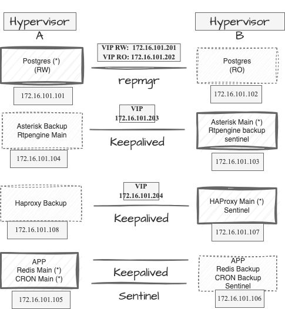
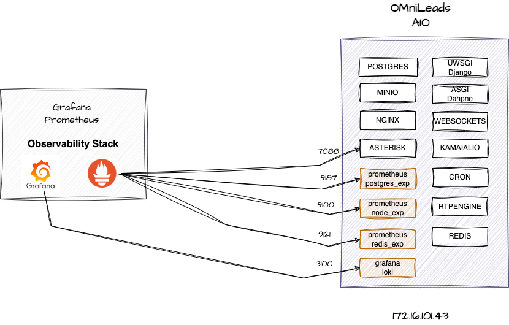

#### This project is part of OMniLeads


#### 100% Open-Source Contact Center Software
#### [Community Forum](https://forum.omnileads.net/)

---

## Ansible System-D based OMniLeads management

In this repository you will find an alternative to implement OMniLeads tenant management from an on-premise
IT management perspective, but also completely viable for working in cloud-computing environments.

The idea is to be able to manage several OMniLeads tenants from this ansible based management tool.

This option covers everything, from installing new instances, managing updates to executing backup & restore procedures,
all that using a single script and configuration file.


## Index

* [Bash, Ansible & System D](#bash-ansible-systemd)
* [Ansible + Inventory](#ansible-inventory)
* [Bash Script deploy.sh](#bash-script-deploy)
* [Subscriber tracking & TLS certs](#subscriber-traking)
* [Deploy LAN instance with self-hosted backend (Postgres & Object Storage)](#onpremise-deploy)
* [Deploy Cloud instance with backend (Postgres y Object Storage) as cloud service](#cloud-deploy)
* [Deploy High Availability OMniLeads on premise instance](#onpremise-deploy)
* [TLS Certs provisioning](#tls-cert-provisioning)
* [Deploy an upgrade](#upgrades)
* [Deploy a rollback](#rollback)
* [Deploy a backup](#backups)
* [Deploy a restore](#restore)
* [Deploy an upgrade from CentOS7](#upgrade_from_centos7)
* [Observability](#observability)


## Bash, Ansible & System D 📋 <a name="bash-ansible-systemd"></a>

The management of multiple instances is done from the administrator's workstation. When preparing a new deployment
there are three fundamental files that are invoked in a chain, which help to understand how the management is planned
of the tenants, these are:

* **deploy.sh**: launch the root ansible playbook invoking the inventory file corresponding to the tenant that you want to manage.
* **inventory.yml**: configuration parameters of the OMniLeads instance to be deployed.
* **matrix.yml**: the ansible root playbook

Each instance of OMniLeads is generated on three Linux instances (application, voice, and data).
In other words, we are going to have a Linux instance dedicated to executing the containers corresponding to the Application stack, 
on the second the containers of the voice processing stack are executed and on the third those of the data stack.


Then, once OMnileads is deployed on the corresponding instances, each container on which a component works
can be managed as a systemd service.

```
systemd start component
systemd restart component
systemd stop component
```


## Ansible + Inventory 🔧 <a name="ansible-inventory"></a>

The inventory file is the configuration source of the instance on which you are going to work.
Parameters such as the component image version or configuration issues are adjusted there
database (users, passwords, etc.).

Regarding this file, we are going to review the main parameters, that is, those that do or should I
adjust for a successful installation.

We start with the data to provide about the three necessary linux instances, there we must
load the IP addresses corresponding to each linux instance so that Ansible can set the
connection, in addition to providing the LAN IP address of each instance.

So on the one hand we have the *ansible_host* parameter that implies the IP address over which
the SSH connection must be established by Ansible, while the *omni_ip_lan* parameter does
reference to a private address on which OMniLeads raises some services and uses
to communicate between the three instances. It may happen that both are worth the same (especially
in a deployment scenario over LAN or VPN)

```
all:
  hosts:
    omnileads_data:
      omldata: true
      ansible_host: 172.16.101.41
      omni_ip_lan: 172.16.101.41
      ansible_ssh_port: 22      
    omnileads_voice:
      omlvoice: true
      ansible_host: 172.16.101.42
      omni_ip_lan: 172.16.101.42
      ansible_ssh_port: 22      
    omnileads_app:
      omlapp: true
      ansible_host: 172.16.101.43
      omni_ip_lan: 172.16.101.43
      ansible_ssh_port: 22   
```

Then we count the tenant variables to display, labeled/indented under *vars:*. Here we find
all the adjustable parameters when invoking a deploy on a group of instances. each one is
described by a *# --- comment* preceding it.

```
vars:
    # --- ansible user auth connection
    ansible_user: root
    # --- Activate the OMniLeads Enterprise Edition - with "AAAA" licensed.
    # --- on the contrary you will deploy OMniLeads OSS Edition with GPLV3 licensed. 
    enterprise_edition: true
    # --- versions of each image to deploy
    # --- versions of each image to deploy
    omnileads_version: 1.26.0
    websockets_version: 230204.01
    nginx_version: 230215.01
    kamailio_version: 230204.01
    asterisk_version: 230204.01
    rtpengine_version: 230204.01
    postgres_version: 230204.01    
    # --- "cloud" instance (access through public IP)
    # --- or "lan" instance (access through private IP)
    # --- in order to set NAT or Publica ADDR for RTP voice packages
    infra_env: cloud
    # --- If you have an DNS FQDN resolution, you must to uncomment and set this param
    # --- otherwise leave commented to work invoking through an IP address
    #fqdn: fidelio.sephir.tech

```

## Bash Script deploy.sh 📄 <a name="bash-script-deploy"></a>

This script receives parameters that command the action to be carried out, this action has to do with invoking the Playbook
matrix.yml who, from the previously edited inventory file, will end up deploying the specific action on the app and voice instances.

```
./deploy.sh --help

```

To run an installation or updates deployment, two parameters must be called.

* **--action=**
* **--tenant=**

```
./deploy.sh --action=install --tenant=tenant_name_folder

```

## Certs and inventory tenant folder :office: <a name="subscriber-traking"></a>

In order to manage multiple instances of OMniLeads from this deployment tool, you must create
a folder called **instances** at the root of this directory. The reserved name for this folder is
**instances** since said string is inside the .gitignore of the repository.

The idea is that the mentioned folder works as a separate GIT repository, thus providing the possibility
to maintain an integral backup in turn that the SRE or systems department is supported in the use of GIT.

```
git clone your_tenants_config_repo instances
```

Then, for each *instance* to be managed, a sub-folder must be created within instances.
For example:

```
instances/Subscriber_A
```

Once the tenant folder is generated, there you will need to place a copy of the *inventory.yml* file available
in the root of this repository, in order to customize and tack inside the private GIT repository.

```
cp inventory.yml instances/Subscriber_A
git add instances/Subscriber_A
git commit 'my new Subscriber A'
git push origin main
```

## Deploy a new LAN instance with Backend (Postgres and Object Storage) self-hosted 🚀 <a name="onpremise-deploy"></a>

You must have two Linux instances (Ubuntu 22.04, Debian 11, Rocky 8 or Alma Linux 8) with Internet access and **your public key (ssh) available**, since
ansible needs to establish an SSH connection through public key.


Then you should work on the inventory.yml file

Regarding addresses and connections. The parameter *omni_ip_lan* refers to the private IP (LAN) that will be used when opening certain ports for components, as well as when they connect with each other.

```
all:
  hosts:
    omnileads_data:
      omldata: true
      ansible_host: 10.10.10.2 
      omni_ip_lan: 10.10.10.2
      ansible_ssh_port: 22      
    omnileads_voice: 
      omlvoice: true
      ansible_host: 10.10.10.3
      omni_ip_lan: 10.10.10.3
      ansible_ssh_port: 22      
    omnileads_app:
      omlapp: true
      ansible_host: 10.10.10.4
      omni_ip_lan: 10.10.10.4
      ansible_ssh_port: 22  
```

The infra_env parameter should be initialized as 'lan'.

```
infra_env: lan
```

And finally, the *bucket_url* and *postgres_host* parameters must be commented out, so that both (PostgreSQL and Object Storage MinIO) are deployed within the data instance.

The rest of the parameters can be customized as desired.

Finally, the deploy.sh should be executed.

```
./deploy.sh --action=install --tenant=tenant_name_folder
```

## Deploy a new instance with Backend (Postgres and Object Storage) as a managed Cloud service 🚀 <a name="cloud-deploy"></a>

You must have three Linux instances (Debian 11 or Rocky 8) with Internet access and **your public key (ssh) available**, since
Ansible needs to establish an SSH connection to deploy the actions.

Also under this format it is assumed that PostgreSQL and S3-compatible Object Storage are going to be provided as managed services by the selected cloud provider. This implies that these two OMniLeads components will not be deployed on the data instance as in the previous case.


We are going to propose a reference inventory, where the cloud provider is supposed to give us the connection data to Postgres.
The parameter *postgres_host* must be assigned the corresponding connection string.
Then it is simply a matter of adjusting the other connection parameters, according to whether we are going to need to establish an SSL connection, set the *postgres_ssl: true* and don't forget to set *postgres_out: true*
If the PostgreSQL service involves a cluster with more than one node, then it can be activated by *postgres_ha: true* and *postgres_ro_host: X.X.X.X*
to indicate that the queries are impacted on the cluster replica node.

Regarding storage over Object Storage, the URL must be provided in *bucket_url*.
Also the authentication parameters must be provided; *bucket_access_key* & *bucket_secret_key* as well as the *bucket_name*.
Regarding the bucket_region, if you do not need to specify anything, you should leave it with the current value.

Some cloud providers example:

* Vultr example:

```
postgres_host: vultr-prod-04b0caa5-03fc-402d-95db-de5fb0bbeb1c-vultr-prod-a539.vultrdb.com
bucket_url: https://sjc1.vultrobjects.com

# --- PostgreSQL    
postgres_out: true
postgres_port: 16751
postgres_user: vultradmin
# --- *postgres* or *defaultdb* depend ...
postgres_maintenance_db: defaultdb
postgres_ssl: true
```

* Digital Ocean example:


```
postgres_host: private-oml-pgsql-do-user-6023066-0.b.db.ondigitalocean.com
bucket_url: https://sfo3.digitaloceanspaces.com

# --- PostgreSQL    
postgres_out: true
postgres_port: 25060
postgres_user: doadmin
postgres_password: AVNS_nQepH0Igjf23gj1f312gjfhjGHJGHJG
postgres_database: omnileads
# --- *postgres* or *defaultdb* depend ...
postgres_maintenance_db: defaultdb
postgres_ssl: true
```

Finally the deploy is launched:

```
./deploy.sh --action=install --tenant=tenant_name_folder
```

## Deploy High Availability onpremise instance 🚀 <a name="cloud-deploy"></a>


We have an inventory file capable of materializing a high availability cluster on 2 Hypervisors (physical servers).  

The cluster essentially replicates all OMniLeads components in such a way that if one of the servers goes down, it can continue to operate by moving the services to the node that is still on.


The postgres, redis, asterisk, rtpengine, haproxy and CRON components are deployed in an Active-Passive scheme, i.e. there is one node that processes requests while the other remains in standby or Read Only state (in the case of Postgres, asterisk, rtpengine, haproxy and CRON). 
node that processes the requests while the other remains in standby or Read Only state (for Postgres).

In this deployment format, OMniLeads needs a load balancing stage to receive the Web requests.
and distribute them under some algorithm on the two instances (one VM on each hypervisor node) of the application that are executed.

On the side of the Web components (uwsgi, websockets, nginx, kamailio and daphne) they are arranged in an Active-Active format being 
Haproxy does the HTTP request balancing on both Active instances. 

There should be 8 virtual machines distributed under the following scheme:

* **Hypervisor A:** App + Redis Main, Postgres Main, Voice Backup
* **Hypervisor B:** App + Redis Backup, Postgres Backup, Voice Main


* Redis: Sentinel, who is the cluster manager, is used. He promotes on the basis of a logic the role of each Redis.
* Postgres: repmgr is used, which is the cluster director. Who promotes on a logical basis the role of each Postgres.
* Asterisk: Keepalived is used in order to supervise the active node and in case of a fall of the same one, to raise the Virtual IP (VIP) on the Failover node.
* HAProxy: Keepalived is used in order to monitor the active node and in case of node downtime, raise the Virtual IP (VIP) on the Failover node.
* Web Application: these nodes run as Active-Active, i.e. there are two instances of App running and attending requests based on the balancing that Haproxy carries out in a previous stage. 


>  Note: Access to an external Object Storage bucket is required. That is to say that the installation of OMniLeads
>in HA does not contemplate the deployment of MinIO Object Storage for now, so it is necessary to have the bucket and its access keys in order to continue with a high >availability deployment of the of the App in high availability, it is necessary to have the bucket and its access keys.


### Let's deploy !

To deploy our cluster we must have 2 VMs with CentOS7 (for the Postgres cluster) on one side and 6 VMs with Debian11 (or ubuntu-22.04 or rocky linux 8) to build the App, Voice and Load balancer clusters. 

Let's assume the following distribution of components on the VMs and IP configuration:

```
VM data RW: 172.16.101.101 (Hypervisor A)
VM data RO: 172.16.101.102 (Hypervisor B)
VM voice main: 172.16.101.103 (Hypervisor B)
VM voice backup: 172.16.101.104 (Hypervisor A)
VM app+redis main: 172.16.101.105 (Hypervisor A)
VM app+redis backup: 172.16.101.106 (Hypervisor B)
VM haproxy main: 172.16.101.107 (Hypervisor B)
VM haproxy backup: 172.16.101.108 (Hypervisor A)

VIP postgres RW: 172.16.101.201
VIP postgres RO: 172.16.101.202
VIP voice_host: 172.16.101.203
VIP haproxy_host: 172.16.101.204
```

Then, as an example, we will continue with the IPs proposed at the time of creating the inventory file.

```
---
############################################
omnileads_data:
  hosts:
    sql_1:  
      ansible_host: 172.16.101.101      
      omni_ip_lan: 172.16.101.101
      ansible_ssh_port: 22
      ha_rol: main
    sql_2:  
      ansible_host: 172.16.101.102
      omni_ip_lan: 172.16.101.102
      ansible_ssh_port: 22  
      ha_rol: backup
  vars:
    postgres_host_ha: true
    ha_vip_nic: eth0
    netaddr: 172.16.101.0/16
    netprefix: 24
############################################
omnileads_voice:
  hosts:
    voice_1:  
      ansible_host: 172.16.101.103
      omni_ip_lan: 172.16.101.103
      ansible_ssh_port: 22
      ha_rol: main
    voice_2:
      ansible_host: 172.16.101.104
      omni_ip_lan: 172.16.101.104
      ansible_ssh_port: 22
      ha_rol: backup
  vars:
    omlvoice: true
    ha_vip_nic: ens18    
############################################
omnileads_haproxy:
  hosts:
    haproxy_1:
      ansible_host: 172.16.101.108
      omni_ip_lan: 172.16.101.108
      ansible_ssh_port: 22
      ha_rol: main
    haproxy_2:  
      ansible_host: 172.16.101.109
      omni_ip_lan: 172.16.101.109
      ansible_ssh_port: 22  
      ha_rol: backup
  vars:
    omlhaproxy: true
    ha_vip_nic: ens18
    app_port: 443
############################################
omnileads_app:
  hosts:
    app_1:  
      ansible_host: 172.16.101.105
      ansible_ssh_port: 22
      omni_ip_lan: 172.16.101.105
      ha_rol: main
    app_2:
      ansible_host: 172.16.101.106
      ansible_ssh_port: 22
      omni_ip_lan: 172.16.101.106
      ha_rol: backup
  vars:
    ha_vip_nic: ens18
    omlapp: true
############################################

all: 
  vars:
    # --- ansible user auth connection
    ansible_user: root

    # -- Cluster Redis IP (Haproxy VIP)
    redis_host: 172.16.101.204
    # --  Cluster redis Main node
    redis_ip_main: 172.16.101.104
    # --  Cluster postgres RW IP
    postgres_host: 172.16.101.201
    # --  Cluster postgres RO IP
    postgres_ro_host: 172.16.101.201
    # --  Cluster Voice (Asterisk + RTPengine) IP
    voice_host: 172.16.101.203
    # -- Cluster HTTP Web App (HAProxy VIP)
    application_host: 172.16.101.204
    # -- Cluster public NAT IP
    omni_ip_wan: 190.19.150.8

    kamailio_version: 230204.01
    asterisk_version: 230328.01
    rtpengine_version: 230204.01
    omnileads_version: 1.26.0
    websockets_version: 230204.01
    nginx_version: 230215.01
    postgres_version: 230204.01
    centos_postgresql_version: 11

    # --- Activate the OMniLeads Enterprise Edition - with "AAAA" licensed.
    # --- on the contrary you will deploy OMniLeads OSS Edition with GPLV3 licensed. 
    enterprise_edition: true
    omnileads_ha: true
    ha_notification_email: fabian.pignataro@freetechsolutions.com.ar

    # -- Cluster public NAT IP
    omni_ip_wan: 190.19.150.8
    # --  Cluster redis IP
    # --  Use in case of run RTPEngine out of this deploy
    # rtpengine_host: 172.16.101.203
    # -- Dialer host
    # dialer_host: 10.10.10.10
    # -- Bucket URL for Django & Asterisk
    bucket_url: https://172.16.101.3:9000
    # --- ansible user auth connection
    ansible_user: root
    # --- version of each image to deploy
    # --- "cloud" instance (access through public IP)
    # --- or "lan" instance (access through private IP)
    # --- in order to set NAT or Publica ADDR for RTP voice packages
    infra_env: lan
    # --- If you have an DNS FQDN resolution, you must to uncomment and set this param
    # --- otherwise leave commented to work invoking through an IP address
    #fqdn: fabis.sefirot.cloud
    ...
    ...
    ...
    ...
```

> Note: Remember that all VMs must have the ssh key of our deployer: **ssh-copy-id root@....**.

Finallly:

```
./deploy.sh --action=install --tenant=tenant_name_folder
```

The layout of the components contemplates the execution of both the RW node of postgres and redis on the hypervisor A, 
while the active node of Asterisk and Haproxy on hypervisor B.



Therefore we have a failover if the Hypervisor-A crashes then the Postgres-RW and Redis-RW components fail over to Hypervisor-B.
on Hypervisor-B. While if Hypervisor-B goes down the Haproxy-active and Asterisk-active components execute a failover on Hypervisor-A. 
failover to Hypervisor-A.

### Recovery Postgres main node

When a Failover from Postgres Main to Postgres Backup occurs, then the Backup node takes the floating IP of the cluster and remains as the only RW/RO node with its corresponding IPs. 
as the only RW/RO node with its corresponding IPs. 

To return Postgres to the initial state two actions must be carried out:

```
./deploy.sh --action=pgsql_node_recovery_main --tenant=tenant_name_folder
```

This command is in charge of rejoining the Postgres Main node to the cluster. But if we only execute this action then 
the Cluster will be inverted, i.e. Postgres B as main and Postgres A as backup.

### Takeover Postgres main node


This command implies that a Recovery has been previously executed as described in the previous step.

```
./deploy.sh --action=pgsql_node_takeover_main --tenant=tenant_name_folder
```

After the execution of the takeover we will have the cluster in the initial state, i.e. Postgres A as Main and Postgres B as backup.

### Takeover Redis main node


A last action to be taken has to do with the takeover of the Redis node, in such a way that we leave the Redis cluster in the initial state, i.e. Redis A as main and Redis B as backup, that is to say Redis A as main and Redis B as backup.

```
./deploy.sh --action=redis_node_takeover_main --tenant=tenant_name_folder
```

### Recovery Postgres backup node

When the VM hosting the Postgres Backup node shuts down, the Main node takes the floating RO IP of the cluster and remains as the only RW/RO node with its corresponding IPs. as the only RW/RO node with its corresponding IPs. To rejoin the backup node to the cluster and in this way recover the RO's VIP, it is necessary to run a
the RO VIP, a recovery deploy of the postgres backup node must be executed.

```
./deploy.sh --action=pgsql_node_recovery_backup --tenant=tenant_name_folder
```


## TLS/SSL certs provisioning :closed_lock_with_key: <a name="tls-cert-provisioning"></a>


From the inventory variable *certs* you can indicate what to do with the SSL certificates.
The possible options are:

* **selfsigned**: which will display the self-signed certificates (not recommended for production).
* **custom**: if the idea is to implement your own certificates. Then you must place them inside instances/tenant_name_folder/ with the names: *cert.pem* for and *key.pem*
* **certbot**: comign soon ...


## Post-installation steps :beer:


Once the URL is available with the App returning the login view,  we can log in with the user *admin*, password *admin*.

It is also possible to generate a test environment by calling:

```
oml_manage.sh --init_env
```

Where some users, routes, trunks, forms, breaks, etc. are generated.

From then on we can log in with the agent type user *agent*, password *agent1**.


## Perform a Backup :floppy_disk: <a name="backups"></a>


Deploying a backup involves the asterisk custom configuration files /etc/asterisk/custom on the one hand and the database
on the other, using the bucket associated with the instance as a backup log.

To launch a backup, simply call the deploy.sh script:

```
./deploy.sh --action=backup --tenant=tenant_name_folder
```

The backup is deposited in the bucket, being under the backup folder on one side a .sql file with the timestamp and on the other side another directory is generated with the timestamp date and there are the custom and override asterisk files.
another directory is generated with the timestamp date and there inside are the asterisk custom and override files.


## Upgrades :arrows_counterclockwise:  <a name="upgrades"></a>

The OMniLeads project builds images of all its components to be hosted in docker hub: https://hub.docker.com/repositories/omnileads.

We are going to differentiate the web application repository (https://hub.docker.com/repository/docker/omnileads/omlapp/general) whose
semantics implies the string RC (release candidates) or stable (able to deploy on production) string, before the dated version.

For example:

```
pre-release-1.27.0
1.27.0
```

On the other hand, the rest of the components (asterisk, rtpengine, kamailio, nginx, websockets and postgres) are
named directly with the release date.

For example:

```
230204.01
```

Every time a new Release of the application becomes available as an image in the container registry, it will be impacted.
the **Releases-Notes.md** file available in the root of this repository, which exposes the mapping between the
versions of the images of each component for each release.

Therefore to apply updates we must first launch on this repository:

```
git pull origin main
```

Then indicate at the inventory.yml level within the corresponding tenant folder, the versions
desired.

```
omnileads_version: 1.26.0
websockets_version: 230204.01
nginx_version: 230215.01
kamailio_version: 230204.01
asterisk_version: 230204.01
rtpengine_version: 230204.01
postgres_version: 230204.01
```

Then the deploy.sh script must be called with the --upgrade parameter.

```
./deploy.sh --action=upgrade --tenant=tenant_name_folder
```

## Rollback  :leftwards_arrow_with_hook: <a name="rollback"></a>


The use of containers when executing the OMniLeads components allows us to easily apply rollbacks towards versions
frozen history and accessible through the "tag".

```
omnileads_version: stable-190112.01
websockets_version: 190112.01
nginx_version: 190112.01
kamailio_version: 190112.01
asterisk_version: 190112.01
rtpengine_version: 190112.01
postgres_version: 190112.01
```

Then the deploy.sh script must be called with the --upgrade parameter.

```
./deploy.sh --action=upgrade --tenant=tenant_name_folder
```

## Restore :mag_right: <a name="restore"></a>


You can proceed with a restore on a fresh installation as well as on a productive instance. 

Apply restore on the new instance: The two final parameters of the inventory.yml must be uncommented. On the one hand to indicate that the bucket does not have trusted certificates and the second one is to indicate the restore that we want to execute.
```
restore_file_timestamp: 1681215859 
```

Run restore deploy:

```
./deploy.sh --action=restore --tenant=digitalocean_deb
```


## Upgrade from CentOS-7 OMniLeads instance <a name="upgrade_from_centos7"></a>


You must deploy an "all in three" instance of OMniLeads making sure that the inventory.yml variables listed below should be the same as their 
counterparts in the CentOS 7 instance from which you want to migrate. below should be the same as their counterparts in the CentOS 7 instance from which you want to migrate.

* ami_user
* ami_password
* postgres_password
* postgres_database
* postgres_user
* dialer_user
* dialer_password

On the OMniLeads 1.2X CentOS-7 instance run the following commands to generate a postgres backup on the one hand 
and then upload to the Bucket Object Storage of the new OMniLeads version the recordings, telephony audios, Asterisk customizations (if any) _custom.conf & _override.conf. 
(if any) Asterisk _custom.conf & _override_conf customizations and also the Postgres backup itself.

```
export NOMBRE_BACKUP: algun_nombre
pg_dump omnileads > /tmp/pgsql-backup-$NOMBRE_BACKUP.sql
export AWS_ACCESS_KEY_ID=uLZTnLB0aURXI6NB
export AWS_SECRET_ACCESS_KEY=VSlMrqEWS7aWtgrn7G2zs949W6jdFleY
export S3_ENDPOINT=https://172.16.101.3:9000
export S3_BUCKET_NAME=tenant1 # nombre del bucket del inventory.yml env 2.0
aws --endpoint ${S3_ENDPOINT} --no-verify-ssl s3 sync /opt/omnileads/media_root s3://${S3_BUCKET_NAME}/media_root
aws --endpoint ${S3_ENDPOINT} --no-verify-ssl s3 sync /opt/omnileads/asterisk/var/spool/asterisk/monitor/ s3://${S3_BUCKET_NAME}
aws --endpoint ${S3_ENDPOINT} --no-verify-ssl s3 cp /tmp/pgsql-backup-$NOMBRE_BACKUP.sql  s3://${S3_BUCKET_NAME}/backup/
mkdir /opt/omnileads/asterisk/etc/asterisk/custom
cd /opt/omnileads/asterisk/etc/asterisk
cp *_custom* ./custom
cp *_override* ./custom
aws --endpoint ${S3_ENDPOINT} --no-verify-ssl s3 sync /etc/asterisk/custom/ s3://${S3_BUCKET_NAME}/backup/asterisk/$NOMBRE_BACKUP/
```

From the fact of having everything necessary to restore the service on the new infrastructure in the Bucket of the same one, 
you can proceed with the deploy of this restoration process. 

At the end of the file there is the variable *restore_file_timestamp* which must contain the name used in the previous step to refer to the backups.
previous step to refer to the backups taken.

```
restore_file_timestamp: NOMBRE_BACKUP
```

Execute the restore deploy on the tenant in question:

```
./deploy.sh --action=restore --tenant=tenant1
```


## Observability :mag_right: <a name="observability"></a>


Inside each subscriber linux instance the deployer put some containers in order to apply the stack observability. In order to not only be able to 
to observe metrics at the operating system level but also to obtain specific metrics of components such as redis, postgres or asterisk, 
as well as to get the logs of the operating system and the also to get the logs of the operating system and the components and send them to the observability stack.

This allows us to propose a multi-instance observability center. On which it is possible to centralize the monitoring of OS and application metrics
of the OS and the application and its components, as well as centralizing log analysis.

This is possible thanks to the Prometheus approach together with its exporters for metrics monitoring on the one hand, and Loki and Promtail on the other. 
while Loki and Promtail implement the centralization of logs.

* **Homer SIP Capture**: used to receive the SIP/RTP information sent to it by Asterisk (hep.conf). Homer stores this data and also provides a web interface to view real-time SIP traces.
* **Prometheus**: used to collect performance metrics from both the hosts (application / voice) and their components (asterisk, redis, postgres, etc.), also collects the metrics reported by SIP Homer Capture itself .
* **Loki**: used to storage file logs generated by OMniLeads components like django, nginx, kamailio, etc.
* **Promtail**: used to parse logs file on Linux VM nd send this to Loki DB.



Finally, you will be able to have an instance of Grafana and Prometheus that invoke this Prometheus deployed on tenat like data-source in order
to them build dashboards, on the other hand Grafana must to invoke the Loki deployed on tenant like data-source for logs analisys.


## Security 

OMniLeads is an application that combines Web (https), WebRTC (wss & sRTP) and VoIP (SIP & RTP) technologies. This implies a certain complexity and 
when deploying it in production under an Internet exposure scenario. 

On the Web side of the things the ideal is to implement a Reverse Proxy or Load Balancer ahead of OMnileads, i.e. exposed to the Internet (TCP 443) 
and that it forwards the requests to the Nginx of the OMniLeads stack. On the VoIP side, when connecting to the PSTN via VoIP it is ideal to 
operate behind an SBC (Session Border Controller) exposed to the Internet.

However, we can intelligently use the **Cloud Firewall** technology when operating over VPS exposed to the Internet.
This way we can perfectly secure the Linux instances (data, voice and web) that make up OMniLeads. 

Below are the Firewall rules to be applied on each instance:

Translated with www.DeepL.com/Translator (free version)

### Data

* 3100/TCP Loki: this is where the connections coming from the monitoring center are processed, more precisely from Grafana, are processed. This port can be opened by restricting by origin on the IP of the monitoring center.

### Voice

* 5060/UDP Asterisk: This is where SIP requests for incoming calls from the ITSP(s) are processed. This port must be opened by restricting by origin on the IP(s) of the PSTN SIP termination provider(s).

* 20000/50000 UDP Asterisk & RTPengine: this port range can be opened to the entire Internet.

### Web

* 443/tcp Nginx: This is where Web/WebRTC requests to Nginx are processed. Port 443 can be opened to the entire Internet.

* 9190/tcp Prometheus: This is where the connections coming from the monitoring center, more precisely from Prometheus, are processed. This port can be opened by restricting by origin in the IP of the monitoring center.

## License & Copyright

This project is released under the GNU Affero General Public License as published by the Free Software Foundation, either version 3 of the License, or (at your option) any later version.
